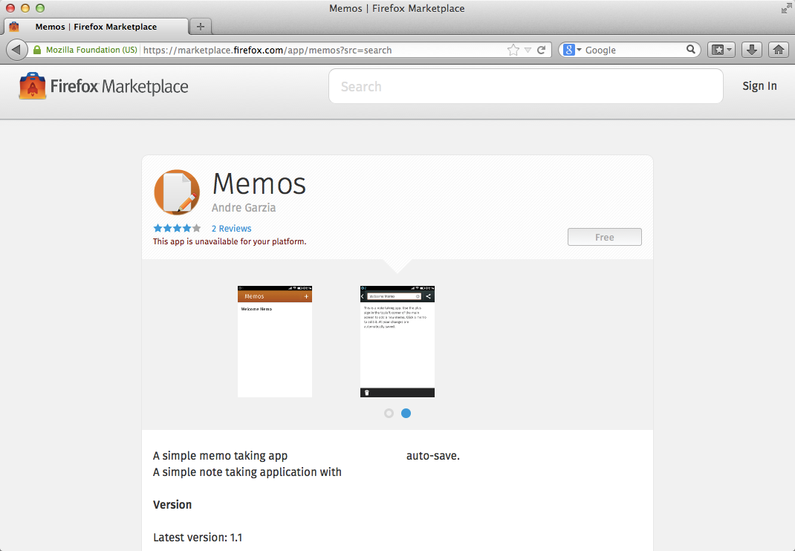
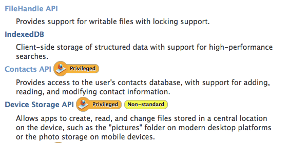
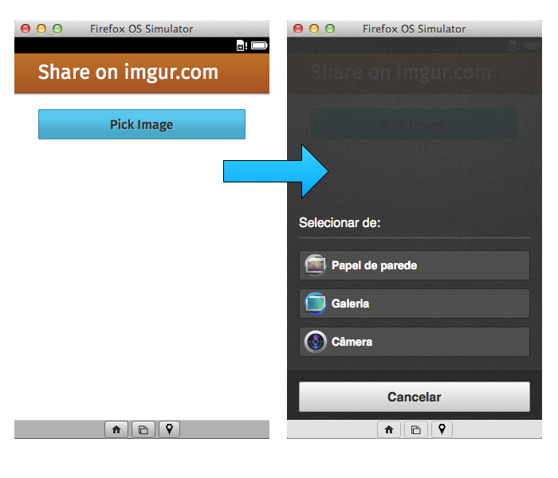

# Concetti Base {#concepts}

Prima di sporcarci le mani con la nostra prima applicazione, vediamo di scoprire alcuni concetti base per lo sviluppo su Firefox OS. Nell'[introduzione](#introduction) abbiamo detto che le applicazioni Firefox OS, analogamente alle pagine web, sono basate su HTML5, tuttavia non abbiamo spiegato cosa rende le applicazioni per Firefox OS differenti dalle pagine web classiche. 

Se utilizziamo le nostre conoscenze riguardo le altre piattaforme *mobile* (Android o iOS per citare i più diffusi) possiamo osservare che le applicazioni native hanno delle caratteristiche ben definite:

* Un nome e un'icona con cui l'utente lancia l'applicazione.
* Accesso ai **servizi di sistema** (dati utente, notifiche) e **funzionalità hardware** (sensori).

Osservando il quadro generale, un'applicazione Firefox OS non è altro che una pagina web con una icona, un nome e di solito è in grado di funzionare anche non in linea (decisione che spetta allo sviluppatore). Tutti i dati dell'applicazione come nome, icona ecc. sono definiti nel *file manifesto dell'applicazione*, che sarà l'argomento della prossima sezione.

## File manifesto dell'applicazione

Il [manifesto][1] è un file [JSON][2] obbligatorio che contiene i **metadati** dell'applicazione. Questo file è chiamato **manifest.webapp** e viene posizionato accanto al classico file HTML **index.html**, nella stessa cartella.
Questi metadati servono al sistema per sapere il nome dello sviluppatore, la versione, i permessi richiesti per le varie API, l'icona, le lingue in cui è disponibile e molto altro.

<<[Manifest d'esempio](code/sample_manifest.webapp)

Sopra possiamo vedere il manifest di un'applicazione chiamata Memos[^promemoria]. Tra le altre cose descrive chi ha creato l'applicazione, quali icone usare, qual è il nome dell'applicazione, quale file è usato per lanciare l'applicazione (in questo caso *index.html*), quali permessi d'accesso hardware richiede l'applicazione, ecc. Questo file è usato da Firefox OS per aggiungere l'applicazione alla schermata principale e per mostrare sul Firefox Marketplace le informazioni dell'applicazione.

[^promemoria]: Questa applicazione di esempio per Firefox OS è disponibile su [Firefox Marketplace][3] e il [codice sorgente è su GitHub][4].



Si noti come le informazioni del file manifesto sono utilizzate dal sistema per aggiungere le applicazioni alla schermata principale, come è possibile osservare nella seguente schermata.


Riunendo il codice HTML, CSS, JavaScript e un file manifesto è già possibile avere un'applicazione pronta per funzionare su Firefox OS. Continuando nell'esplorazione dei concetti base per lo sviluppo di un'app, vediamo ora quali sono i vari tipi di applicazioni possibili.

### Il nostro primo manifest

Come possiamo notare, il manifest è composto da un elenco di informazioni che scriviamo separando il _nome_ dell'informazione dal suo _valore_ tramite il carattere ":", e separiamo ogni informazione con una ",", come per un elenco.

#### Cosa mettere nel manifest

È obbligatorio inserire *name*, *description* e *icons*; il campo *launch_path* indica il file da avviare (necessario se l'app è *packaged*) e il campo *developer* che con le sue proprietà *name* e *url* definiscono, rispettivamente, nome e URL dello sviluppatore dell'applicazione (utili nel caso vogliate pubblicare la vostra app sul Mozilla Marketplace).

### Le proprietà del manifest

Il manifest descrive una marea di proprietà utili, perciò vediamo il nome e l'utilità di ognuna.

**activities**

La proprietà *activities* specifica quali *Web Activities* supporta la nostra applicazione.
Registrare la vostra applicazione come una "Web Activities" vi permette di rendere la vostra applicazione accessibile alle altre.
Volendo fare un'esempio, se voi sviluppate un applicazione che permette di condividere le vostre foto su di un sito, potreste implementare la web activities *share*; in questo modo, quando l'utente prova a condividere una foto dall'app galleria, apparirà anche la vostra applicazione tra quelle che possono svolgere questo compito.
La sintassi di questo campo è un po' complessa, per questo vi rimando alla pagina di documentazione su [MDN][5].

**chrome**

Il campo *chrome* indica se la vostra applicazione fa uso dei pulsanti di navigazione predefiniti dal sistema come vediamo nell'immagine  
  
*Nota*: tenete presente che questa funzionalità va utilizzata solo se non è possibile implementare una soluzione propria, poiché le linee guida per l'user experience prevedono l'inserimento di un tasto *back* da parte dell'applicazione.  
La sintassi della proprietà è la seguente:
```
"chrome": { "navigation": true }
```

**default_locale**

Questo parametro è necessario quando è presente anche la proprietà *locales* ed indica qual è la lingua predefinita dell'applicazione  ovvero quella che verrà usata se nel sistema è impostata una lingua per cui non avete traduzioni.

Esempio per l'inglese
```
"default_locale": "en"
```

**description**

La descrizione dell'applicazione (massimo 1024 caratteri), siate il più chiari e sintetici possibile perché questo è il testo che verrà visualizzato sul Mozilla Marketplace (successivamente si può modificare).

**developer**

Abbiamo incontrato questa proprietà nel manifest di prova, puoi indicare chi è lo sviluppatore e qual è il suo sito web.

**fullscreen**

Se impostata a *true*, metterà la vostra applicazione a schermo intero (utile per i giochi) nscondendo la barra delle notifiche.

**icons**

Anche questa proprietà era presente nell'esempio e serve per far sapere quali risoluzioni dell'icona mettiamo a disposizione.
Naturalmente è bene fornire la stessa icona con più risoluzioni, in modo che il dispositivo prenda quella adeguata; pensate a come sarebbe piccola l'icona pensata per il telefono rispetto a quelle del tablet o, ancora peggio, rispetto a quelle di uno schermo da 40 pollici.
Alcune dimensioni sono obbligatorie per il Mozilla Marketplace.

**installs_allowed_from**

Indica una serie di siti a cui è permesso installare l'applicazione (questo campo è inutile se pubblicate la vostra app solamente nel Mozilla Marketplace).
Se usate il vostro sito come base per la vostra applicazione allora dovete inserirlo in questo campo.

**launch_path**

Ne abbiamo già parlato nel codice di esempio più in alto.  
Questo campo indica il percorso di lancio dell'applicazione che deve essere relativo ed è obbligatorio per le app packaged.

**locales**

Questa proprietà ci permette di impostare i dati come URL o description per le varie lingue in cui è rilasciata l'app.

Esempio:
```
"locales": {
"es": {
  "description": "¡Acción abierta emocionante del desarrollo del Web!",
  "developer": {
    "url": "http://es.mozillalabs.com/"
  }
},
"it": {
  "description": "Emozionati nello sviluppo libero del Web!",
  "developer": {
    "url": "http://it.mozillalabs.com/"
  }
}
}
```

**messages**

Indica quali messaggi del sistema la vostra app può leggere per eseguire del codice specifico.

Esempio:
```
"messages": [
  { "telephony-new-call": "/dialer/index.html#keyboard-view" },
  { "bluetooth-dialer-command": "/dialer/index.html#keyboard-view" },
  { "headset-button": "/dialer/index.html#keyboard-view" },
  { "notification": "/dialer/index.html#keyboard-view" },
  { "alarm": "/facebook/fb_sync.html" }
]
```
Il campo **messages** così compilato permette, per esempio, di aprire la pagina `/dialer/index.html` all'ancora `#keyboard-view` quando l'evento *telephony-new-call* viene rilevato dal telefono.

**name**

Indovinate? Il nome della vostra app!

**orientation**

Questa proprietà imposta l'orientamento predefinito dell'applicazione, i due valori ammessi sono "landscape" e "portrait" (predefinito). Lasciatela vuota o addirittura non mettetela se non vi interessa.

**origin**

Indica un'URL che l'applicazione può utilizzare al posto dell'UUID, è raro utilizzare questo valore.

**permissions**

Proprietà chiave del manifest, permette di chiedere all'utente il permesso di utilizzare elementi specifici del telefono, come la geolocalizzazione, i contatti, ...

Esempio:
```
"permissions": {
  "contacts": {
    "description": "Required for autocompletion in the share screen",
    "access": "readcreate"
    },
  "alarms": {
    "description": "Required to schedule notifications"
  }
}
```

In questo caso abbiamo richiesto due permessi: l'accesso all'elenco dei contatti in modalità lettura/creazione e la possibilità di usare la sveglia.

Inoltre bisogna fornire due ulteriori campi, un campo *description* in cui bisogna spiegare all'utente a cosa ci serve il permesso e un campo *access* opzionale in cui specificate il grado d'accesso.
I valori possibili sono *readonly*, *readwrite*, *readcreate* e *createonly*.

**redirects**

Permette di impostare un redirect da un sito esterno, per esempio per ragioni di autenticazione.  
Richiede un campo *from* di input e uno *to* di elaborazione.

**type**

Indica se la vostra app è *web*, *privileged* o *certified*. Le certified sono particolari e la loro certificazione avviene solo tramite il Mozilla Marketplace o tramite il debug remoto.

**version**

Il numero di versione della vostra app sotto forma di *stringa*.

<<Important: Github fornisce tramite Github Pages il mime type giusto per il file manifest. Alcuni sviluppatori distribuiscono le proprie applicazioni hosted da Github, il vantaggio è che sono sempre aggiornate e finché si tratta di applicazioni semplici in JavaScript è una buona soluzione hosting. Vedi l'ultimo capitolo per approfondimenti.

## Tipi di Applicazioni

Attualmente esistono due tipi di applicazioni Firefox OS che potete sviluppare: ospitate (*hosted*) e pacchettizzate (*packaged*) - forse in futuro saranno disponibili altri tipi di applicazioni (per esempio che consentiranno di personalizzare la tastiera o di creare altri servizi di sistema).

W> Nota del traduttore: è sempre difficile rendere alcuni termini tecnici in italiano, nel sito di Firefox Marketplace è stato scelto di tradurre le *hosted app* in app ospitate e le *packaged app* in app pacchettizzate. Ciò nonostante nel mondo degli sviluppatori italiani si usano i termini *app hosted* e *app packaged*. Nel proseguo del testo verranno utilizzati entrambi i termini a discrezione dei localizzatori.

* **App Hosted:** Sono disponibili ad un indirizzo web come [www.mozilla.org][6] esattamente come i classici siti web. Questo significa che quando l'utente avvia un'applicazione hosted, il suo contenuto è caricato dal server remoto (o dalla cache, se disponibile).
* **App Packaged:** Sono distribuite come file zip e vengono salvate nel dispositivo al momento della loro installazione. Quando l'utente avvia un'app pacchettizzata, i suoi contenuti sono caricati da un file zip nel dispositivo anziché da un server remoto.

Esistono vantaggi e svantaggi nell'utilizzo di entrambi i tipi. Da un lato le *app hosted* sono più facili da aggiornare, infatti è sufficiente cambiare i file sul server web. Però è più complicato implementare il loro funzionamento in modalità non in linea in quanto richiede l'utilizzo del tanto discusso file [**appcache**][7]. Inoltre, le *hosted app* hanno delle limitazioni nell'uso di alcune WebAPI e dunque non è possibile implementare tutte le funzioni che si possono utilizzare in un'*app packaged*.

Dall'altro lato tutti i file di un'*app packaged* sono memorizzati localmente sul dispositivo - ciò significa che sono sempre disponibili quando l'utente non è collegato (e quindi non sarà necessario utilizzare AppCache). Hanno anche la possibilità di accedere a WebAPI sensibili per la sicurezza che non sono disponibili per le *app hosted*. Il loro aggiornamento può essere problematico, perché sarà necessario caricare qualsiasi nuova versione su Firefox Marketplace - ciò significa far sostenere a ogni nuova versione dell'applicazione il processo di revisione che potrebbe richiedere un po' di tempo.

Quando si sceglie quale tipo di applicazione realizzare è necessario fare delle valutazioni: se si dovranno utilizzare delle WebAPI avanzate sarà necessario orientarsi verso un'*app packaged*. Se l'app che si sta progettando può funzionare senza accedere a servizi di sistema avanzati o funzionalità del dispositivo oltre a quelle già disponibili in un browser web, sarà necessaria un'*app hosted*. In caso non si disponga di un server per la distribuzione utilizzare il tipo *app packaged*.

Sopra ho detto che utilizzare AppCache può essere complicato (ma talvolta è indispensabile per alcune *app hosted*). Niente paura, esistono degli strumenti per semplificare la generazione di file AppCache e facilitare il processo di distribuzione[^js-tools].

In questo testo vedremo come realizzare applicazioni *packaged*, in quanto questo ci permetterà di esplorare tutte le possibilità offerte dalle WebAPI. In ogni caso la maggior parte di ciò che vedremo sui file manifest si applica anche alle *app hosted*. Per ulteriori informazioni sulla distribuzione delle *app hosted* consultare [la documentazione sulle *app hosted* nel Centro di sviluppo][8].

[^js-tools]: Esistono molti strumenti utili, come [Grunt][9], [Volo][10], [Yeoman][11], [Bower][12]. Questi strumenti sono molto spesso equivalenti nel risultato ed è una questione di preferenza. (Mi piace Volo rispetto a Grunt perché i Volofiles sono più semplici da leggere).

Ora che abbiamo trattato i due tipi di applicazioni supportate da Firefox OS, diamo un'occhiata ai diversi livelli di accesso che un'app può richiedere.

## Livelli di accesso per la sicurezza

Esistono tre livelli di sicurezza su Firefox OS - ogni livello fornisce un maggiore accesso alle API rispetto a quello precedente.

* **Semplice (a.k.a. web):** questo è il livello predefinito di tutte le applicazioni. Questo livello si applica alle *app hosted* e alle *app packaged* che non dichiarano una proprietà `type` nel loro file manifesto. Queste applicazioni hanno un accesso alle comuni API dei browser - ma non hanno un accesso ad alcuna delle WebAPI Mozilla.
* **Con privilegi:** questo tipo di applicazioni ha accesso a tutte le API disponibili nel browser Firefox, oltre a quelli aggiuntivi, come i contatti e gli allarmi di sistema. Solo **le packaged possono essere app con privilegi** ed il pacchetto deve essere firmato digitalmente dal Marketplace Firefox.
* **Certificato:** per motivi di sicurezza, questo livello è permesso per le app realizzate direttamente da Mozilla e dai suoi partner (per esempio i fornitori dell'hardware, le compagnie di telecomunicazione, ecc…). Le applicazioni certificate hanno un accesso a tutte le API, come l'API Telephony e altro ancora. Un esempio di applicazione certificata in Firefox OS è il telefono.

Durante lo sviluppo è possibile accedere alle API con privilegi senza richiedere permessi speciali a Mozilla. In fase di distribuzione, però, sarà necessario caricare l'app sul Firefox Marketplace. A questo punto il codice viene controllato in un rigoroso processo di approvazione e se è tutto OK l'app sarà firmata digitalmente - questo garantirà agli utenti di Firefox OS che a questa applicazione è consentito accedere alle API sensibili.

Sulla [pagina delle WebAPI sul Mozilla Developer Network][13] è possibile verificare quali API sono implementate sui vari dispositivi e controllare il livello di accesso necessario per utilizzare ciascuna API.



Come si può vedere dall'immagine qui sopra, qualsiasi applicazione può accedere alle API *IndexedDB API e FileHandle API* ma solamente le app con privilegi possono accedere ai *Contacts API* e *Device Storage API*.

## WebAPI di Mozilla

Firefox OS fornisce le API necessarie per sviluppare applicazioni con le stesse funzionalità delle applicazioni native sulle altre piattaforme. L'accesso al hardware ed ai servizi avviene attraverso le WebAPI. Per saperne di più sulle API disponibili nelle varie versioni di Firefox OS consultare [la pagina WebAPI nel Wiki Mozilla][14].

Analizzeremo alcuni esempi di codice per vedere come le API sono facili da utilizzare. Gli esempi non vanno presi come una documentazione completa sulle WebAPI, sono una piccola dimostrazione di come si possa accedere al dispositivo usando JavaScript.

### Esempio #1: Effettuare chiamate

Si immagini di avere un'applicazione che ha bisogno di usare il dialer con un numero di telefono già pronto. È sufficiente utilizzare il seguente codice:

<<[Invia un numero di telefono al dialer](code/webapi_samples/dial.js)

Questo codice effettua una richiesta all'applicazione dialer per chiamare un numero predefinito. In realtà non partirà la chiamata, sarà necessario l'esplicita conferma dell'utente che dovrà toccare il tasto di chiamata per avviarla. La richiesta di un'azione esplicita dell'utente prima di avviare un'operazione è un modello molto comune: si tratta di un buon modello di sicurezza perché è richiesta un'esplicita conferma dell'utente prima di avviare un'operazione.
Altre API possono effettuare chiamate senza una interazione dell'utente ma richiedono un livello d'accesso più elevato. Le applicazioni certificate possono effettuare chiamate senza interazione con l'utente. Le API usate nel codice sopra, chiamate "Web Activities", sono disponibili per tutte le applicazioni.

Per maggiori informazioni sull'API Web Activities consultare  [questo post sul blog Mozilla][15].

### Esempio #2: Memorizzare un contatto

Si immagini di avere una rete intranet aziendale e di voler sviluppare un'app per trasferire i contatti dalla rete intranet alla rubrica telefonica. È possibile farlo grazie alla Contacts API.

<<[Salvare un contatto](code/webapi_samples/contact.js)

Questa API crea un oggetto con i dati del contatto e lo salva nella rubrica telefonica senza bisogno di alcuna interazione da parte dell'utente. Poiché l'accesso ai contatti comporta implicazioni riguardo la privacy, questa API è disponibile per le *app con privilegi*. Il modello di questa API prevede l'utilizzo di due callback ed è un approccio condiviso da molte altre API. Forniamo quindi due funzioni, *success* in caso di buona riuscita dell'operazione e *error* in caso contrario da eseguire una volta che si è risolta l'azione principale (in questo caso salvare un contatto).

Per ulteriori informazioni su questa API consultare [la pagina dedicata alle *Contacts API* sul wiki Mozilla][16].

### Esempio #3: Selezionare una immagine dalla fotocamera

Si immagini di voler creare un'app che applichi delle decorazioni alle immagini, come una cornice o dei baffi. Sarà quindi necessario utilizzare un pulsante che permetta di scattare una foto con la fotocamera o scegliere l'immagine da una galleria.

<<[Scegliere una foto](code/webapi_samples/pick.js)

Questo è un altro esempio di [WebActivity][17]. Le funzioni (activity) dell'API WebActivities sono disponibili per tutte le applicazioni. In questo esempio specifico stiamo usando la *pick* activity passando il *MIME Types* dei file richiesti. Quando questo codice è eseguito, il sistema mostra una schermata all'utente chiedendo se vuole selezionare l'immagine da camera, galleria o sfondi. Se l'utente seleziona una immagine, la callback di successo viene invocata. Se l'utente annulla l'operazione, la callback di errore è eseguita. Nell'immagine sottostante, possiamo vedere la finestra di richiesta sul dispositivo:



## Riassunto

In questo capitolo abbiamo visto che rispetto alle pagine web classiche, entrambi i tipi di applicazione per Firefox OS (hosted e packaged) si basano su un file manifest. Abbiamo visto anche che dal punto di vista della sicurezza le applicazioni packaged possono essere **con privilegi** o **certificate**. Solo le app privilegiate e certificate possono accedere alle WebAPI di Mozilla. Le WebAPI non sono disponibili per le applicazioni hosted o le pagine web classiche.

Adesso è giunta l'ora di sporcarsi le mani e creare un'applicazione.

[1]: https://developer.mozilla.org/docs/Apps/Manifest
[2]: http://json.org
[3]: https://marketplace.firefox.com/app/memos
[4]: https://github.com/soapdog/memos-for-firefoxos
[5]: https://developer.mozilla.org/en-US/docs/WebAPI/Web_Activities
[6]: http://mozilla.org
[7]: https://developer.mozilla.org/docs/HTML/Using_the_application_cache
[8]: https://marketplace.firefox.com/developers/docs/hosted
[9]: http://gruntjs.com
[10]: http://volojs.org/
[11]: http://yeoman.io/
[12]: http://bower.io/
[13]: https://developer.mozilla.org/en-US/docs/WebAPI
[14]: https://wiki.mozilla.org/WebAPI
[15]: https://hacks.mozilla.org/2013/01/introducing-web-activities/
[16]: https://wiki.mozilla.org/WebAPI/ContactsAPI
[17]: https://hacks.mozilla.org/2013/01/introducing-web-activities/
