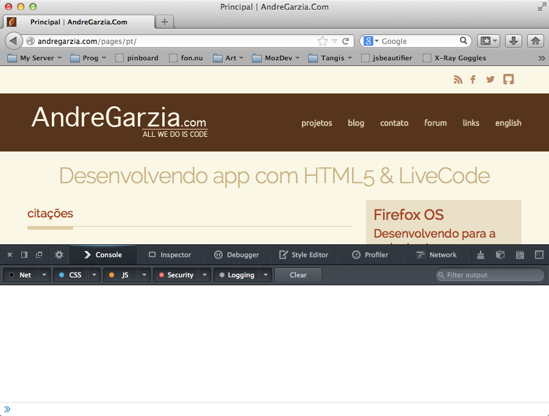

# Strumenti per sviluppatori {#developertools}

Firefox mette a disposizione molti strumenti per consentire agli sviluppatori di fare il proprio lavoro al meglio. Molte persone continuano a usare [FireBug](https://addons.mozilla.org/it/firefox/addon/firebug/) senza aver realizzato che ora Firefox ha degli strumenti di sviluppo nativi. In questo capitolo andremo ad analizzare gli strumenti più utili per sviluppare app per Firefox OS.

Se sei interessato a saperne di più su questi strumenti e conoscere quali straordinari nuovi strumenti sono in fase di sviluppo nelle prossime versioni di Firefox, consulta la pagina [developer tools](https://developer.mozilla.org/en-US/docs/Tools) su Mozilla Developer Network (Ci conto, apri davvero questo link. Ti aspetto).
 
## Introduzione alla Visualizzazione flessibile

Un'attività molto comune durante lo sviluppo web è quella di modificare il sorgente HTML di una pagina e poi ricaricarla per vedere le modifiche effettuate all'opera nel browser. A meno che non si stiano utilizzando strumenti quali *Grunt* o *Volo*, di solito, non sarà necessario effettuare un'operazione intermedia come la compilazzione del sorgente, o per lo meno qualcosa che le assomiglia. Anche se il Firefox OS Simulator consente di effettuare questa attività, attualmente, il simulatore è in grado di utilizzare un'unica risoluzione schermo di 480x320 pixell. Questo non è certo l'ideale mentre si sta cercando di sviluppare un'app che debba funzionare su tablet, phablet, grandi schermi TV o qualunque altro dispositivo con una diversa risoluzione.

Per controllare l'aspetto della tua app con qualunque tipo di risoluzione, puoi utilizzare lo strumento **Visualizzazione flessibile** di Firefox per cambiare lo schermo e il riquadro di visualizzazione. Può essere attivata dal menu **Strumenti -> Sviluppo web -> Visualizzazione flessibile** come mostrato nell'immagine qui di seguito. All'attivazione della modalità di visualizzazione flessibile, la finestra diventerà “ridimensionabile“ in modo da permetterti di ridimensionarla, trascinando gli angoli o impostandone le dimensioni nelle apposite caselle.

L'utilizzo della *Visualizzazione flessibile* è particolarmente utile al fine di testare le [**media queries**](https://developer.mozilla.org/en-US/docs/Web/Guide/CSS/Media_queries), in quanto ti permette di ridimensionare lo schermo e visualizzare la reazione del layout del tuo sito in tempo reale. Un'altra utile caratteristica della **Visualizzazione flessibile**è la possibilità di memorizzare delle dimensioni schermo predefinite. Se conosci già le dimensioni schermo che vuoi testare, potrai farlo velocemente senza dover ogni volta ridimensionare la finestra.

Al momento della stesura di questo libro, la maggior parte degli smartphone Firefox OS in commercio utilizzano schermi di 480x320 pixel con una densità punto di 96 dpi. Tuttavia, c'è da aspettarsi che questo cambi nel tempo: gli schermi avranno dimensioni maggiori e maggiori densità punto (come gli schermi Retina di Apple).

Nell'eventualità di future verifiche della tua app, segui questo consiglio: non basare mai i tuoi CSS su una specifica risoluzione schermo o densità punto. Piuttosto, dovresti utilizzare le *media query* e una metodologia di design responsivo, per permettere alla tua app di adattarsi alle varie risoluzioni schermo. Per saperne di più sul design responsivo, ti consiglio la lettura di uno o entrambi questi libri: [Responsive Web Design](http://www.abookapart.com/products/responsive-web-design) e [Mobile First](http://www.abookapart.com/products/mobile-first).

Riepilogando, la **Visualizzazione flessibile** ci permette di testare la nostra app su varie risoluzioni schermo senza dover ridimensionare la finestra di Firefox. A mio modesto avviso, la *Visualizzazione flessibile* è uno degli strumenti di sviluppo più utili a disposizione - purtroppo ha un grande limite: attualmente non consente di testare differenti configurazioni di densità punto.

## Strumenti di sviluppo

Gli strumenti di sviluppo di Firefox sono simili a quelli disponibili con l'estensione Firebug o in altri browser di nuova generazione. Utilizzando questi strumenti è possibile eseguire ed effettuare il debug del codice JavaScript utilizzando la [*console*](https://developer.mozilla.org/en-US/docs/Web/API/console) e manipolare sia il DOM che i fogli di stile CSS della pagina. 

Esistono diversi modi per invocare la Console:

	* Dal menu Strumenti -> Sviluppo web -> Console web
 * Facendo clic col tasto destro nella pagina da analizzare e scegliendo "Ispeziona elemento" e quindi selezionando la scheda Console.

 

Oltre alla *Console JavaScript* sono disponibili molti altri strumenti come [*l'Editor stili*](https://developer.mozilla.org/en-US/docs/Tools/Style_Editor), [*il Monitor di rete*](https://developer.mozilla.org/en-US/docs/Tools/Network_Monitor), [*il Profiler JavaScriptr*](https://developer.mozilla.org/en-US/docs/Tools/Profiler), [*il Debugger JavaScript*](https://developer.mozilla.org/en-US/docs/Tools/Debugger), [*lo strumento Analisi pagina*](https://developer.mozilla.org/en-US/docs/Tools/Page_Inspector) e molti altri.

Nell'applicazione che abbiamo creato nel precedente capitolo abbiamo utilizzato la Console web per verificare lo stato di avanzamento del nostro progetto. Questo è un modo elegante e molto efficace di effettuare il debug delle nostre app - anche se alcuni sviluppatori continuano a utilizzare l'istruzione `alert()` all'interno di tutti i loro sorgenti JavaScript come loro “strumento di debugging”.

L'utilizzo dell'istruzione `alert()` è davvero un metodo deprecabile, in quanto se ci si dimentica di rimuovere tutti gli `alert()` dal sorgente prima di rilasciare l'app, sarà l'utente a pagarne le conseguenze. L'utilizzo della Console permette di evitare questo tipo di problemi, la Console, infatti, consente di instradare, in maniera semplice e innoqua, questi messaggi in un luogo al quale di solito un utente non accede, non disturbando così l'esperienza utente. L'utilizzo della Console inoltre, evita di dover rimuovere le istruzioni che generano i messaggi di log dal codice sorgente, a meno che tu non lo voglia davvero fare, ovviamente. Questo ti aiuterà nelle operazioni di manutenzione e di debugging del codice sorgente nel caso che lci fossero dei bug non previsti (come accade solitamente con qualunque codice sorgente).

Imparare a utilizzare in modo appropriato gli strumenti di sviluppo inclusi in Firefox (o in qualunque altro browser in uso) è un importante passo nel processo di diventare uno sviluppatore migliore. È per questo che consiglio a tutti di consultare i link riportati qui sopra e approfondire la propria conoscenza degli strumenti di sviluppo inclusi in Firefox.

Uno speciale strumento che non è stato sin qui menzionato è il [*Debugger remoto*](https://developer.mozilla.org/en-US/docs/Tools/Remote_Debugging). Questo strumento consente di connettersi a un smartphone Android o Firefox OS e utilizzare gli altri strumenti di sviluppo per effettuare il debug in tempo reale del codice sorgente in esecuzione su questi dispositvi.

## Sommario

In questo capitolo sono stati descritti in maniera sintetica gli strumenti di sviluppo inclusi in Firefox. L'utilizzo di questi strumenti renderà il processo di sviluppo più semplice, specialmente quando si utilizzano insieme al Firefox OS Simulator. Rappresentano una combinazione indispensabile per permetterci di sviluppare un'app. Nel prossimo capitolo andremo a conoscere più da vicino il simulatore e impareremo a farne un buon uso.