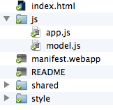

# La prima app {#firstapp}

In questo capitolo vedremo come realizzare un semplice **Notepad**, cioè un'applicazione per prendere appunti. Prima di concentrarci sul codice cerchiamo di studiare il funzionamento di questa applicazione.

La nostra idea è di avere di tre schermate. La prima è la schermata principale, la prima che l'utente vedrà, in cui presentiamo l'elenco delle note già salvate. Se si fa clic su una nota (o se ne viene aggiunta una) viene aperta la schermata con i dettagli, nella quale è possibile modificare il titolo ed il testo della nota scelta. Ecco come vorremmo che si presentassero.

Dalla parte superiore dello schermo è possibile cancellare una nota prescelta se si fa clic sul Cestino. Questa azione aprirà una finestra di conferma.

Il codice sorgente di Memos è disponibile nel [Repository su Github][1] (è possibile anche scaricarlo come file [.zip][2] ). Consiglio di scaricare i file, così sarà più semplice seguire la guida. Un'altra copia del codice sorgente è disponibile nella cartella nella [repository Github di questo libro] [1].

Memos utilizza [IndexedDB][3] per salvare le note e il toolkit [*Gaia Building Blocks*][4] per creare le interfacce. In un futuro aggiornamento il testo conterrà molte informazioni su *Gaia Building Blocks*, ma in questa prima versione mi limiterò ad utilizzarlo. Per ulteriori informazioni sull'argomento e per sapere quali interfacce vi sono integrate visitare i link appena segnalati.

Il primo passaggio è creare una cartella per l'applicazione di nome **memos**.

## Creare il manifesto dell'app

Il file manifesto di Memos è molto semplice. Crea un file chiamato **manifest.webapp** nella cartella **memos**. I manifesti sono dei file in formato [JSON][5] che descrivono un'applicazione per Firefox OS. In questo file è possibile trovare le informazioni sull'app, quali il nome, il nome dello sviluppatore, le icone utilizzate, il file che avvia l'app, quali API e con privilegi sono utilizzate e molto altro.

Qui di seguito è riportato il contenuto del file manifesto di **Memos**. Fate attenzione con il copia e incolla, perché è molto facile mettere una virgola nel posto sbagliato (o non metterla) e creare un file JSON non valido. Esistono molti strumenti per validare un file JSON, incluso uno specifico per validare i file manifesto delle app, lo puoi trovare online su [il marketplace][6]. Per ulteriori informazioni su questi file consultare la [pagina su MDN ][7].

<<[Memos manifest (*manifest.webapp*)](code/memos/manifest.webapp)

Analizziamo i campi di questo file manifesto:

|Campi |Descrizione| 
|------|-----------|  
|name       |    Il nome dell'applicazione |  
|version    |    La versione attuale dell'applicazione |  
|launch_path|    Il file utilizzato per avviare un'applicazione |  
|permissions|    I permessi API richiesti, con molte informazioni|
|developer  |    I contatti dello sviluppatore|  
|icons      |    L'icona utilizzata in diversi formati |  

La parte più interessante di questo file manifesto è la richiesta per i permessi di *storage* per poter utilizzare IndexedDB senza alcun limite di spazio disco[^storage-permission](con questi permessi possiamo salvare le note che vogliamo - anche se dobbiamo fare attenzione a non usare troppo spazio sul disco dell'utente!).

[^storage-permission]: Per saperne di più su questa autorizzazione leggi [la pagina MDN sui permessi][8].

Ora che il file manifesto è pronto, passiamo al codice HTML.

## Scriviamo il codice HTML

Prima di iniziare a lavorare sul codice HTML facciamo una breve digressione su [Gaia Building Blocks][4], una raccolta di codici CSS e JavaScript che rispettano il layout degli elementi d'interfaccia nativi di Firefox OS e che possiamo riutilizzare per creare l'interfaccia della nostra applicazione.

Come nelle pagine web, non è richiesto l'uso del *look and feel* di Firefox OS nella propria applicazione. Utilizzare o meno *Gaia Building Blocks* è una scelta personale - e le buone applicazioni dovrebbero sapersi distinguere per uno stile e un'esperienza utente proprie. La cosa importante da capire è che un'applicazione non subirà alcun tipo di pregiudizio o penalità su Firefox Marketplace se non utilizza lo stile di Gaia. Personalmente, non essendo un bravo designer, preferisco ricorrere a degli *UI toolkit* già pronti piuttosto che creare uno stile personale per le app.

La struttura HTML che utilizzeremo per questa applicazione seguirà gli schemi adottati da *Gaia Building Blocks* in cui ogni schermata è racchiusa in un tag `<section>` e gli elementi seguono un formato predefinito. Se non si è ancora scaricato il codice sorgente dal [repository memos][1], è importante farlo quanto prima poiché contiene i file necessari, inclusi quelli del toolkit *Gaia Building Blocks*. Per coloro che dovessero avere poca confidenza con *git* e *Github*, i file sono disponibili anche come [file .zip][2]. 

W> Attenzione: la versione di *Gaia Building Blocks* che ho utilizzato non è la più recente. Purtroppo, ho dovuto fare questa scelta perché l'applicazione Memos non era compatibile con l'ultima versione di *Gaia Building Blocks*. Nei propri progetti è sempre meglio utilizzare l'ultima versione disponibile del toolkit.

### Includere Gaia Building Blocks

Prima di qualsiasi altra cosa copiare le cartelle **shared** e **styles** incluse nel repository che è stato scaricato, nella cartella **memos** creata in precedenza. Questo consentirà l'utilizzo del toolkit *Gaia Building Blocks* nelle proprie applicazioni.

Iniziamo con l'inserimento del codice necessario nel **file index.html**.

~~~~~~~~
<!DOCTYPE html>
<html>
<head>
    <meta charset="utf-8">
    <link rel="stylesheet" type="text/css" href="/style/base.css" />
    <link rel="stylesheet" type="text/css" href="/style/ui.css" />
    <link rel="stylesheet" type="text/css" href="/style/building_blocks.css" />
    <link rel="stylesheet" type="text/css" href="shared/style/headers.css" />
    <link rel="stylesheet" type="text/css" href="shared/style_unstable/lists.css" />
    <link rel="stylesheet" type="text/css" href="shared/style_unstable/toolbars.css" />
    <link rel="stylesheet" type="text/css" href="shared/style/input_areas.css" />
    <link rel="stylesheet" type="text/css" href="shared/style/confirm.css" />
    <title>Memos</title>
</head>
~~~~~~~~

La prima riga dichiara che il documento utilizza il formato HTML5. Dalla *linea 5 alla 15* vengono inclusi i file CSS dei vari componenti da usare nell'app: testata, liste, campi testuali, ecc…

### Costruiamo la schermata principale

Adesso che abbiamo incluso i riferimenti a *Gaia Building Blocks* possiamo sfruttare il lavoro di Mozilla per creare un'applicazione a 5 stelle.

Iniziamo a costruire le varie schermate. Come abbiamo detto prima, ogni schermata è racchiusa in una `<section>` all'interno del corpo (il tag `<body>`) del documento HTML. All'elemento '<body>' assegnamo un attributo *role* il cui valore deve essere *application*, in questo modo quando l'app verrà lanciata verranno utilizzati i fogli di stile di *Gaia Building Blocks* per definire l'aspetto dell'interfaccia. Scriviamo quindi `<body role="application">`. Adesso creiamo la prima schermata, quindi la prima '<section>', e dichiariamo il tag body come abbiamo detto prima.

~~~~~~~~
<body role="application">

<section role="region" id="memo-list">
    <header>
        <menu type="toolbar">
            <a id="new-memo" href="#">add</a>
        </menu>
        <h1>Memos</h1>
    </header>
    <article id="memoList" data-type="list"></article>
</section>
~~~~~~~~

Nella schermata abbiamo incluso un `<header>` in cui mettiamo un pulsante che permetta di aggiungere nuove note ed il nome dell'applicazione stessa. La schermata include un tag `<article>` che è utilizzato per mostrare il contenuto della nota. Useremo il pulsante e l'ID dell'articolo per catturare gli eventi nella parte JavaScript.

Sottolineo il fatto che ogni schermata è un semplice blocco di codice HTML. Costruire queste schermate utilizzando diversi linguaggi su altri sistemi richiede molto lavoro. Tutto quello che faremo è dare ad ogni contenitore un ID specifico che richiameremo successivamente.

La prima schermata è completa adesso vediamo la schermata di modifica.

### Costruire la schermata di modifica

La schermata di modifica è un po' complessa perché contiene la finestra di dialogo di eliminazione delle note.

~~~~~~~~
<section role="region" id="memo-detail" class="skin-dark hidden">
    <header>
        <button id="back-to-list">back
        </button>
        <menu type="toolbar">
            <a id="share-memo" href="#">share
            </a>
        </menu>
        <form action="#">
            <input id="memo-title" placeholder="Memo Title" required="required" type="text">
            <button type="reset">Remove text</button>
        </form>
    </header>
    

        <textarea placeholder="Memo content" id="memo-content"></textarea>
    

    

        <ul>
            <li>
                <button id="delete-memo" class="icon-delete">Delete</button>
            </li>
        </ul>
    

    <form id="delete-memo-dialog" role="dialog" data-type="confirm" class="hidden">
        <section>
            <h1>Confirmation</h1>
            
Are you sure you want to delete this memo?

        </section>
        <menu>
            <button id="cancel-delete-action">Cancel</button>
            <button id="confirm-delete-action" class="danger">Delete</button>
        </menu>
    </form>
</section>
~~~~~~~~

Nella parte superiore dello schermo, rappresentata dall'elemento `<header>` si trovano:

 * un pulsante per ritornare alla schermata principale
 * un campo di testo per modificare il titolo della nota
 * un pulsante per condividere la nota via email

Sotto questa parte è presente il testo della nota racchiuso dal tag `<textarea>` , ancora più sotto  c'è una seconda barra con il pulsante per cancellare la nota attuale.

Questi tre elementi e il loro contenuto rappresentano la schermata di modifica. Successivamente abbiamo un elemento `<form>` che verrà utilizzato per mostrare la finestra di conferma di cancellazione della nota. Questa finestra è molto semplice, contiene del testo e due pulsanti, uno per cancellare la nota ed uno per annullare l'azione.

A questo punto chiudiamo il tag `<section>` avendo tutte le schermate necessarie, il codice HTML rimanente serve per includere i file JavaScript e completare il documento HTML con tutti i tag di chiusura.

~~~~~~~~

</body>
</html>
~~~~~~~~

## Manipoliamo il codice JavaScript

Adesso ci divertiremo a dare vita alla nostra applicazione utilizzando JavaScript. Per organizzare meglio questo codice ho scelto di suddividerlo in due file:

* **model.js:** contiene le routine per salvare e recuperare le note dalla memoria del dispositivo, ma non la struttura logica, la gestione dei click sugli elementi dell'interfaccia e la gestione dell'input utente, questi sono nel secondo file, in questo modo abbiamo scritto del codice modulare. In teoria potremmo riutilizzare questo file in altre applicazioni che creano e gesticono note per l'utente.
* **app.js:** collega gli eventi dell'interfaccia agli elementi HTML e contiene la struttura logica dell'applicazione.

Entrambi i file devono essere posizionati nella cartella **js** che troviamo accanto alle cartelle **style** e **shared**.

### model.js

Utilizzeremo [IndexedDB][3] per salvare le note nel dispositivo. Avendo chiesto i permessi *storage* nel file manifesto possiamo salvare quante note vogliamo - però non dobbiamo abusarne!

Infatti i dispositivi Firefox OS solitamente non hanno molta memoria da dedicare alle app e il loro contenuto (le note nel nostro caso) ed è sempre meglio essere consapevoli di quali dati vengono memorizzati, inoltre gli utenti daranno un voto negativo a un'applicazione se consumerà troppa memoria senza motivo. Memorizzare troppo materiale porta a problemi di prestazioni e l'app risulterà lenta e poco reattiva. Al momento del caricamento su Firefox Marketplace, sarà necessario indicare nel modulo diretto ai revisori il motivo per cui l'app necessita di accesso illimitato alla memoria per il suo funzionamento, se non lo segnalate vi verrà esplicitamente richiesto dai revisori. Nel caso non siate in grado di giustificare tale richiesta, i revisori respingeranno l'app, che quindi non verrà pubblicata sul sito.

La parte di codice in *model.js* che mostriamo qui sotto si occupa del collegamento e della creazione dello storage.

A> Importante: Questo codice è scritto per essere capito velocemente e non per illustrare le migliori tecniche di programmazione JavaScript. Nel codice sono presenti delle variabili globali (andrò all'inferno per questo, lo so) tra le altre chicche. La gestione degli errori è praticamente inesistente. Lo scopo principale di questo testo è insegnare il *workflow* di sviluppo di applicazioni per Firefox OS e non i migliori pattern JS, quindi a seconda dei commenti migliorerò il codice, sempre che non abbia un brutto impatto sui principianti.  

~~~~~~~
var dbName = "memos";
var dbVersion = 1;

var db;
var request = indexedDB.open(dbName, dbVersion);

request.onerror = function (event) {
    console.error("Can't open indexedDB!!!", event);
};
request.onsuccess = function (event) {
    console.log("Database opened ok");
    db = event.target.result;
};

request.onupgradeneeded = function (event) {

    console.log("Running onUpgradeNeeded");

    db = event.target.result;

    if (!db.objectStoreNames.contains("memos")) {

        console.log("Creating objectStore for memos");

        var objectStore = db.createObjectStore("memos", {
            keyPath: "id",
            autoIncrement: true
        });
        objectStore.createIndex("title", "title", {
            unique: false
        });

        console.log("Adding sample memo");
        var sampleMemo1 = new Memo();
        sampleMemo1.title = "Welcome Memo";
        sampleMemo1.content = "This is a note taking app. Use the plus sign in the topleft corner of the main screen to add a new memo. Click a memo to edit it. All your changes are automatically saved.";

        objectStore.add(sampleMemo1);
    }
}
~~~~~~~

A> Importante: chiedo ancora perdono per aver utilizzato delle variabili globali, questo è solo del materiale utile all'insegnamento. Inoltre ho rimosso i commenti dal codice per risparmiare spazio nel testo. Su Github il codice è completo di commenti.

Il codice appena visto crea un oggetto *db* ed un oggetto *request*. L'oggetto *db* è utilizzato in altre funzioni per manipolare le note memorizzate.

Nell'implementazione della funzione `request.onupgradeneeded` creiamo una nota di benvenuto. Questa funzione è eseguita quando l'applicazione viene lanciata per la prima volta (o quando la versione del database cambia). In questo modo, al primo avvio dell'applicazione, il database conterrà una nota di esempio.  

Una volta aperta la connessione al database e inizializzato il meccanismo di archiviazione, è ora di creare le funzioni basilari per manipolare le note.

~~~~~~~~
function Memo() {
    this.title = "Untitled Memo";
    this.content = "";
    this.created = Date.now();
    this.modified = Date.now();
}

function listAllMemoTitles(inCallback) {
    var objectStore = db.transaction("memos").objectStore("memos");
    console.log("Listing memos...");

    objectStore.openCursor().onsuccess = function (event) {
        var cursor = event.target.result;
        if (cursor) {
            console.log("Found memo #" + cursor.value.id + " - " + cursor.value.title);
            inCallback(null, cursor.value);
            cursor.continue();
        }
    };
}

function saveMemo(inMemo, inCallback) {
    var transaction = db.transaction(["memos"], "readwrite");
    console.log("Saving memo");

    transaction.oncomplete = function (event) {
        console.log("All done");
    };

    transaction.onerror = function (event) {
        console.error("Error saving memo:", event);
        inCallback({
            error: event
        }, null);

    };

    var objectStore = transaction.objectStore("memos");

    inMemo.modified = Date.now();

    var request = objectStore.put(inMemo);
    request.onsuccess = function (event) {
        console.log("Memo saved with id: " + request.result);
        inCallback(null, request.result);

    };
}

function deleteMemo(inId, inCallback) {
    console.log("Deleting memo...");
    var request = db.transaction(["memos"], "readwrite").objectStore("memos").delete(inId);

    request.onsuccess = function (event) {
        console.log("Memo deleted!");
        inCallback();
    };
}
~~~~~~~~

In questo blocco di codice abbiamo creato un costruttore che produce nuove note con alcuni campi già inizializzati. Dopodiché abbiamo implementato le altre funzioni per la presentazione, il salvataggio e la cancellazione delle note. Molte di queste funzioni richiedono che sia passato un parametro chiamato `inCallback`. Questo parametro è esso stesso una funzione che  verrà invocata al termine della funzione chiamante. Questo è necessario per la natura asincrona di IndexedDB. Tutte le callback hanno la medesima struttura di chiamata `callback(error, value)`, con due parametri in ingresso, in cui uno dei due assumerà il valore `null` a seconda del risultato della funzione chiamante.

A> Siccome è un testo per principianti ho scelto di non usare le [*Promises*][9] perché non tutti potrebbero capirle. Consiglio di usare questi concetti per avere un codice più pulito e facile da mantenere.

Ora che l'archiviazione delle note e le funzioni di modifica sono state implementate, lavoriamo alla struttura logica dell'applicazione nel file **app.js**.

### app.js

Questo file contiene la logica dell'applicazione. Il codice sorgente è troppo lungo da mostrare in una volta sola, quindi verrà diviso in parti per studiarlo meglio.

~~~~~~~~
var listView, detailView, currentMemo, deleteMemoDialog;

function showMemoDetail(inMemo) {
    currentMemo = inMemo;
    displayMemo();
    listView.classList.add("hidden");
    detailView.classList.remove("hidden");
}

function displayMemo() {
    document.getElementById("memo-title").value = currentMemo.title;
    document.getElementById("memo-content").value = currentMemo.content;
}

function shareMemo() {
    var shareActivity = new MozActivity({
        name: "new",
        data: {
            type: "mail",
            body: currentMemo.content,
            url: "mailto:?body=" + encodeURIComponent(currentMemo.content) + "&subject=" + encodeURIComponent(currentMemo.title)

        }
    });
    shareActivity.onerror = function (e) {
        console.log("can't share memo", e);
    };
}

function textChanged(e) {
    currentMemo.title = document.getElementById("memo-title").value;
    currentMemo.content = document.getElementById("memo-content").value;
    saveMemo(currentMemo, function (err, succ) {
        console.log("save memo callback ", err, succ);
        if (!err) {
            currentMemo.id = succ;
        }
    });
}

function newMemo() {
    var theMemo = new Memo();
    showMemoDetail(theMemo);
}
~~~~~~~~

All'inizio vengono dichiarate alcune variabili globali (bleah :-P!) per mantenere dei riferimenti a elementi nel DOM che saranno utilizzati in alcune funzioni. La variabile globale di maggiore interesse è  `currentMemo`, l'oggetto di riferimento per la nota che l'utente sta visualizzando.

Le funzioni `showMemoDetail()` e `displayMemo()` lavorano in coppia. La prima carica la nota selezionata in `currentMemo` e modifica il CSS degli elementi mostrati nella schermata di modifica. La seconda prende il contenuto della variabile `currentMemo` e mostra la nota a schermo. Potremmo mettere il codice nella stessa funzione ma averlo separato permette di divertirci di più con nuove implementazioni.

La funzione `shareMemo()` utilizza una [WebActivity][10] per aprire il programma predefinito per la posta elettronica con il contenuto della nota selezionata.

La funzione `textChanged()` prende il contenuto dei campi e lo inserisce nell'oggetto `currentMemo` che salva la nota. Questo perché avremo un'applicazione con auto-salvataggio. Tutte le modifiche al contenuto o al titolo invocheranno la funzione che salverà in IndexedDB.

La funzione `newMemo()` crea una nuova nota e apre la schermata di modifica con la nuova nota creata.

~~~~~~~~
function requestDeleteConfirmation() {
    deleteMemoDialog.classList.remove("hidden");
}

function closeDeleteMemoDialog() {
    deleteMemoDialog.classList.add("hidden");
}

function deleteCurrentMemo() {
    closeDeleteMemoDialog();
    deleteMemo(currentMemo.id, function (err, succ) {
        console.log("callback from delete", err, succ);
        if (!err) {
            showMemoList();
        }
    });
}

function showMemoList() {
    currentMemo = null;
    refreshMemoList();
    listView.classList.remove("hidden");
    detailView.classList.add("hidden");
}
~~~~~~~~

La funzione `requestDeleteConfirmation()` mostra la richiesta di conferma di cancellazione della nota.

Le funzioni `closeDeleteMemoDialog()` e `deleteCurrentMemo()` sono invocate dai pulsanti nella finestra di conferma.

La funzione `showMemoList()` effettua una pulizia e mostra l'elenco delle note presenti. Per esempio, svuota il contenuto di `currentMemo` se non stiamo leggendo una nota.

~~~~~~~~
function refreshMemoList() {
    if (!db) {
        // HACK:
        // this condition may happen upon first time use when the
        // indexDB storage is under creation and refreshMemoList()
        // is called. Simply waiting for a bit longer before trying again
        // will make it work.
        console.warn("Database is not ready yet");
        setTimeout(refreshMemoList, 1000);
        return;
    }
    console.log("Refreshing memo list");

    var memoListContainer = document.getElementById("memoList");

    while (memoListContainer.hasChildNodes()) {
        memoListContainer.removeChild(memoListContainer.lastChild);
    }

    var memoList = document.createElement("ul");
    memoListContainer.appendChild(memoList);

    listAllMemoTitles(function (err, value) {
        var memoItem = document.createElement("li");
        var memoP = document.createElement("p");
        var memoTitle = document.createTextNode(value.title);

        memoItem.addEventListener("click", function (e) {
            console.log("clicked memo #" + value.id);
            showMemoDetail(value);

        });

        memoP.appendChild(memoTitle);
        memoItem.appendChild(memoP);
        memoList.appendChild(memoItem);

    });
}
~~~~~~~~

La funzione `refreshMemoList()` modifica il [DOM][11] della nostra applicazione aggiornando l'elenco delle note. Sarebbe più facile usare alcuni sistemi di _templating_ come [handlebars](http://handlebarsjs.com/) o [underscore](http://underscorejs.org/) ma quest'applicazione contiene solo *vanilla javascript* quindi faremo tutto a mano.

Queste sono le funzioni utilizzate dall'applicazione. Le uniche che mancano sono il gestore eventi e la chiamata iniziale di `refreshMemoList()`.

~~~~~~~
window.onload = function () {
    // elements that we're going to reuse in the code
    listView = document.getElementById("memo-list");
    detailView = document.getElementById("memo-detail");
    deleteMemoDialog = document.getElementById("delete-memo-dialog");

    // All the listeners for the interface buttons and for the input changes
    document.getElementById("back-to-list").addEventListener("click", showMemoList);
    document.getElementById("new-memo").addEventListener("click", newMemo);
    document.getElementById("share-memo").addEventListener("click", shareMemo);
    document.getElementById("delete-memo").addEventListener("click", requestDeleteConfirmation);
    document.getElementById("confirm-delete-action").addEventListener("click", deleteCurrentMemo);
    document.getElementById("cancel-delete-action").addEventListener("click", closeDeleteMemoDialog);
    document.getElementById("memo-content").addEventListener("input", textChanged);
    document.getElementById("memo-title").addEventListener("input", textChanged);

    // the entry point for the app is the following command
    refreshMemoList();

};
~~~~~~~

Ora che tutti i file sono pronti proviamo l'applicazione nel simulatore.

## Provare l'applicazione sull'App manager

Prima di avviare l'applicazione nel simulatore è preferibile verificare che tutti i file siano al posto giusto altrimenti l'applicazione non funzionerà. Ecco quale dovrebbe essere il contenuto della cartella memos:

Se si ha il vago sospetto di aver commesso qualche errore è possibile verificarlo confrontando [il repository memos su github][1] (un'ulteriore copia del codice sorgente è disponibile  nella cartella **code** nel [repo del testo][12] ).

Tutto a posto? Bene, cominciamo.

Per aprire la *Dashboard del Simulatore* fare clic nel menu **Sviluppo -> Gestore App**.

, fare clic sul pulsante **Aggiungi app locale** e selezionare il file manifesto dell'applicazione.

Se tutto funziona come previsto, Memos apparirà nella lista applicazioni.

Quando si aggiungerà una nuova applicazione, il simulatore verrà avviato con la nuova app in esecuzione. A questo punto è possibile provare tutte le funzionalità di Memos.

Congratulazioni! Abbiamo creato e provato la nostra prima applicazione. Non è un'applicazione complessa o rivoluzionaria - ma spero sia utile per capire il workflow di sviluppo di Firefox OS. Chi ha già visto e lavorato con il web ha di sicuro potuto notare che non è molto diverso dallo sviluppo web classico.  

Sottolineiamo che ogni volta che viene modificato il codice sorgente è necessario premere il pulsante **Aggiorna** per aggiornare il contenuto dell'applicazione presente nel simulatore.

## Riassunto

In questo capitolo abbiamo creato la nostra prima applicazione per Firefox OS e l'abbiamo lanciata nel simulatore. Nel prossimo capitolo vedremo uno strumento molto utile chiamato **BoilerPlate**, un insieme di esempi che rispondono ad esigenze basilari di un'applicazione, come selezionare un contatto dalla rubrica, far vibrare il telefono o controllare la carica della batteria, tutto questo è documentato con codice già pronto e adatto ad ogni evenienza, dallo scattare una foto ad aggiungere un contatto o far vibrare il telefono.

[1]: https://github.com/soapdog/memos-for-firefoxos
[2]: https://github.com/soapdog/memos-for-firefoxos/archive/master.zip
[3]: https://developer.mozilla.org/en-US/docs/IndexedDB/Using_IndexedDB
[4]: http://buildingfirefoxos.com/building-blocks
[5]: http://json.org
[6]: https://marketplace.firefox.com/developers/validator
[7]: https://developer.mozilla.org/docs/Apps/Manifest
[8]: https://developer.mozilla.org/en-US/docs/Web/Apps/App_permissions
[9]: https://developer.mozilla.org/en-US/docs/Mozilla/JavaScript_code_modules/Promise.jsm/Promise
[10]: https://hacks.mozilla.org/2013/01/introducing-web-activities/
[11]: https://developer.mozilla.org/en-US/docs/Web/API/Document_Object_Model/Introduction
[12]: https://github.com/soapdog/guia-rapido-firefox-os