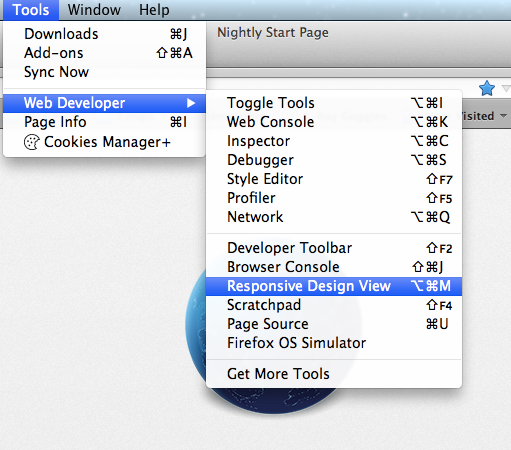
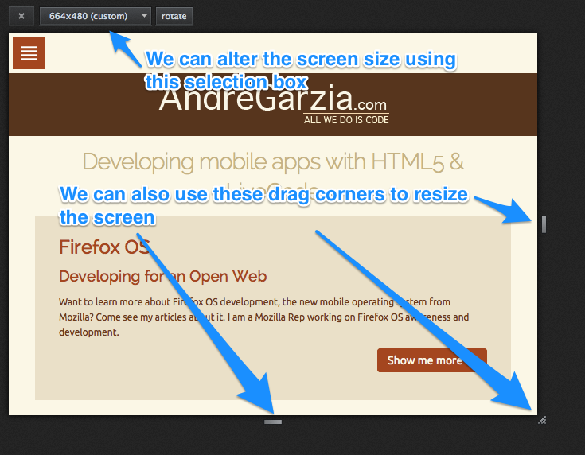

# Strumenti per sviluppatori {#developertools}

Il browser Firefox mette a disposizione molti strumenti per consentire agli sviluppatori di eseguire il proprio lavoro al meglio. Molte persone continuano a usare l'estensione [Firebug][1] senza aver realizzato che ora Firefox ha degli strumenti di sviluppo integrati che possono sostituirlo (anche la versione 3 di Firebug si integrerà con gli strumenti nativi).

In questo capitolo andremo ad analizzare gli strumenti più utili per sviluppare app per Firefox OS.

Se si è interessati a saperne di più su questi strumenti e conoscere quali straordinarie novità in materia di sviluppo web saranno implementate nelle prossime versioni di Firefox, consultare la pagina [developer tools][2] su Mozilla Developer Network (ci conto, apri davvero questo link! Ti aspetto).
 
## Introduzione alla Visualizzazione flessibile

Un'attività molto comune durante lo sviluppo web è quella di modificare il sorgente HTML di una pagina e poi ricaricarla per vedere le modifiche effettuate nel browser. A meno che non si stiano utilizzando strumenti come *Grunt* o *Volo* non sarà necessario effettuare operazioni intermedie.

Anche se il Firefox OS Simulator consente di vedere la tua app attualmente non è in grado di utilizzare risoluzioni diverse da 480x320 pixel. Questo non è certo l'ideale per sviluppare un'app destinata a funzionare su tablet, phablet, grandi schermi TV o qualunque altro dispositivo con una diversa risoluzione.

Per controllare l'aspetto dell'app con qualunque tipo di risoluzione è possibile utilizzare lo strumento **Visualizzazione flessibile (Responsive View)** (Ctrl+Shift+M) di Firefox che permette di cambiare lo schermo e il riquadro di visualizzazione. Può essere attivata dal menu **Strumenti -> Sviluppo web -> Visualizzazione flessibile** come mostrato nell'immagine qui di seguito. All'attivazione della modalità di visualizzazione flessibile, la finestra diventerà “ridimensionabile“ in modo da permettere, appunto, di variarne le dimensioni, trascinando gli angoli o impostandone le dimensioni nelle apposite caselle.

L'utilizzo della **Visualizzazione flessibile** è particolarmente utile al fine di provare le [**media queries**][3], in quanto permette di ridimensionare lo schermo e visualizzare la reazione del layout del proprio sito immediatamente. Un'altra utile caratteristica della **Visualizzazione flessibile** è la possibilità di memorizzare delle dimensioni schermo differenti dalle predefinite. Se si conoscono già le dimensioni schermo che si vuole provare, sarà possibile farlo velocemente senza dover ogni volta ridimensionare la finestra di Firefox. Inoltre permette di scattare uno screenshot dell'area visionata e di simulare gli eventi touch JavaScript.

Al momento della stesura di questo testo, la maggior parte degli smartphone Firefox OS in commercio utilizzano schermi di 480x320 pixel con una densità dei punti di 96 dpi[^itdpi]. Tuttavia c'è da aspettarsi che questa situazione cambi nel tempo: gli schermi avranno dimensioni maggiori e maggiori densità dei punti (come gli schermi Retina di Apple).

[^itdpi]: L'acronimo dpi denota l'unità di misura della densità dei punti, in inglese dots per pixel, cioè punti per pollice (1 pollice corrisponde a 2,54 cm). Per ulteriori informazioni leggere [l'articolo di Wikipedia sull'argomento][4].

Nell'eventualità di future verifiche delle proprie app, si segua questo consiglio: non basare mai i propri CSS su una specifica risoluzione schermo o densità dei punti. Piuttosto, si dovrebbero utilizzare le *media queries* e pensare ad un layout flessibile (*responsive* n.d.t) per permettere all'app di adattarsi alle varie risoluzioni schermo. Per saperne di più sul layout flessibile consiglio la lettura di questi libri: [Responsive Web Design][5] e [Mobile First][6].

Riepilogando, la **Visualizzazione flessibile** ci permette di provare la nostra app a varie risoluzioni dello schermo senza dover ridimensionare la finestra di Firefox. A mio modesto avviso, la **Visualizzazione flessibile** è uno degli strumenti di sviluppo più utili a disposizione - purtroppo ha un grande limite: attualmente non consente di provare differenti configurazioni di densità dei punti, quindi ricordatevi di usare anche dispositivi diversi.

## Strumenti di sviluppo

Gli strumenti di sviluppo di Firefox sono simili a quelli disponibili con l'estensione Firebug o in altri browser di nuova generazione. Utilizzando questi strumenti è possibile eseguire ed effettuare il debug del codice JavaScript tramite la [*console*][7] di Firefox e manipolare sia il DOM che i fogli di stile CSS della pagina.

Esistono diversi modi per invocare la Console:

* Dal menu **Strumenti -> Sviluppo web -> Console del browser** (Ctrl+Maiusc+J)
* Facendo clic col tasto destro nella pagina da analizzare e scegliendo **Ispeziona elemento** e quindi selezionando la scheda Console.

 

Oltre alla *Console JavaScript* sono disponibili altri strumenti come [*l'Editor stili*][8], [*il Monitor di rete*][9], [*il Profiler JavaScript*][10], [*il Debugger JavaScript*][11], [*lo strumento Analisi pagina*][12] e molti altri.

Nell'applicazione che abbiamo creato nel precedente capitolo, abbiamo utilizzato la Console web per verificare lo stato di avanzamento del nostro progetto. Questo è un modo elegante e molto efficace di effettuare il debug delle nostre app, anche se alcuni sviluppatori continuano a utilizzare l'istruzione `alert()` all'interno di tutti i loro sorgenti JavaScript come “strumento di debugging”.

L'utilizzo dell'istruzione `alert()` è davvero un metodo barbaro e deprecabile, in quanto se ci si dimentica di rimuovere tutti gli `alert()` dal sorgente prima di rilasciare l'app, sarà l'utente a pagarne le conseguenze.L'utilizzo della Console permette di evitare questo tipo di problemi: la Console, infatti, consente di inserire questi messaggi, in maniera semplice e innocua, in una interfaccia al quale di solito un utente non accede, risultando così invisibile. L'utilizzo della Console inoltre evita di dover rimuovere le istruzioni che generano i messaggi di log dal codice sorgente, a meno che non lo si voglia davvero fare, ovviamente. Questo ci aiuterà nelle operazioni di manutenzione e di debugging del codice sorgente nel caso ci fossero dei bug imprevisti (come accade solitamente con qualunque codice).

Imparare a utilizzare in modo appropriato gli strumenti di sviluppo inclusi in Firefox (o in qualunque altro browser in uso) è un importante passo nel processo di diventare uno sviluppatore migliore. Per questo motivo consiglio a tutti di consultare i link riportati qui sopra e approfondire la propria conoscenza degli strumenti di sviluppo inclusi in Firefox.

Uno speciale strumento che non è stato sin qui menzionato è il [*Debugger remoto*][13]. Questo strumento consente di connettersi a uno smartphone Android o Firefox OS e utilizzare gli altri strumenti di sviluppo per effettuare il debug delle pagine web aperte su questi dispositivi. Non vi preoccupate, lo vedremo nel prossimo capitolo con un dispositivo dotato di Firefox OS!

## Riassunto

In questo capitolo sono stati descritti in maniera sintetica gli strumenti di sviluppo inclusi in Firefox. Questi strumenti renderanno il processo di sviluppo più semplice, specialmente se utilizzati assieme al Firefox OS Simulator. Rappresentano una combinazione indispensabile per permetterci di sviluppare un'app. Nel prossimo capitolo andremo a conoscere più da vicino il simulatore e impareremo a farne un buon uso.

[1]: https://addons.mozilla.org/it/firefox/addon/firebug/ "Firebug su AMO"
[2]: https://developer.mozilla.org/en-US/docs/Tools "Dev Tools su MDN"
[3]: https://developer.mozilla.org/en-US/docs/Web/Guide/CSS/Media_queries "Media Queries su MDN"
[4]: http://it.wikipedia.org/wiki/Risoluzione_%28grafica%29 "Risoluzione grafica su Wikipedia"
[5]: http://www.abookapart.com/products/responsive-web-design
[6]: http://www.abookapart.com/products/mobile-first
[7]: https://developer.mozilla.org/en-US/docs/Web/API/console
[8]: https://developer.mozilla.org/en-US/docs/Tools/Style_Editor
[9]: https://developer.mozilla.org/en-US/docs/Tools/Network_Monitor
[10]: https://developer.mozilla.org/en-US/docs/Tools/Profiler
[11]: https://developer.mozilla.org/en-US/docs/Tools/Debugger
[12]: https://developer.mozilla.org/en-US/docs/Tools/Page_Inspector
[13]: https://developer.mozilla.org/en-US/docs/Tools/Remote_Debugging
