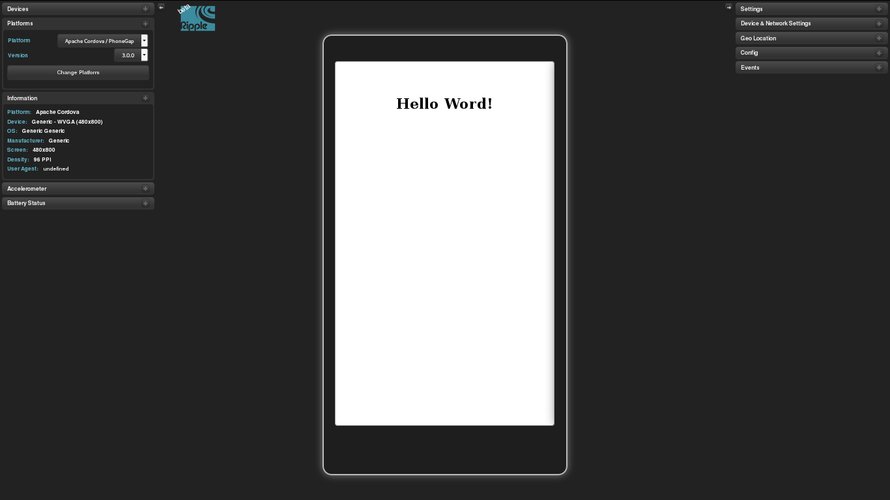
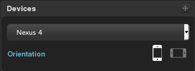
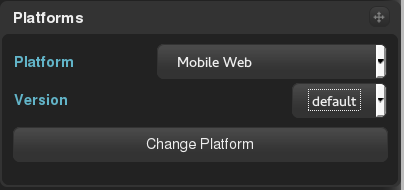
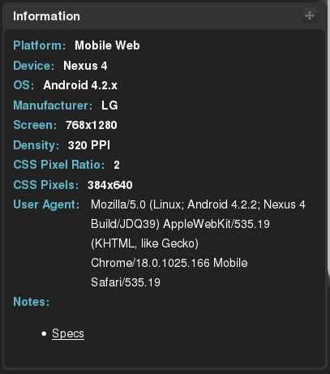
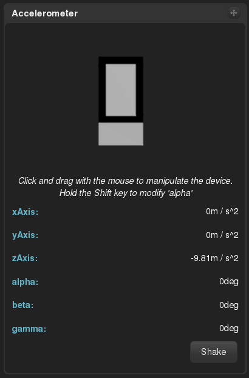
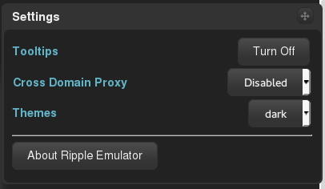
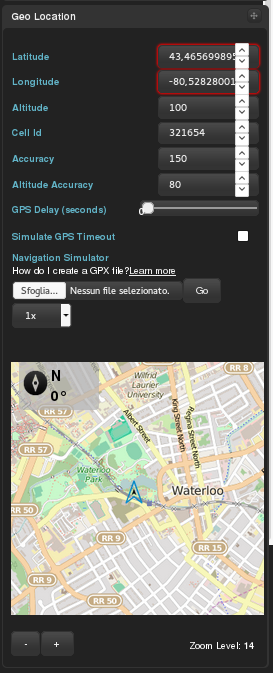

## Ripple Emulator

[Ripple Emulator][1] è un tool di sviluppo per mobile nato come integrazione di Google Chrome, diventato poi uno strumento completamente stand-alone e compatibile con qualsiasi tipo di browser.

Ripple Emulator può essere installato via [npm][2] digitando da terminale:

>$ sudo npm install -g ripple-emulator

e una volta installato può essere lanciato nei modi che seguono:
>$ ripple-emulate --path percorso/della/webapp

per progetti stand-alone, mentre per progetti remoti:

>$ ripple emulate --remote http:// webapp .dominio

## Caratteristiche principali

Ripple Emulator offre un supporto completo al debug di applicazioni web orientate al mondo mobile, offrendo al contempo un'interfaccia semplice e  intuitiva.

Le varie features sono accessibili dai pannelli laterali dell'interfaccia, analizziamoli uno ad uno:

###Devices

Il primo pannello che incontriamo è il pannello Devices, che ci permette di scegliere il dispositivo su cui vogliamo testare il nostro applicativo e l'orientazione dello schermo.
Oltre ai vari dispositivi "Generic" troviamo anche numerosi dispositivi reali, tra i quali molti sono della famiglia Google Nexus, oltre a devices Apple e BlackBerry. Come si può vedere dalla foto il tutto è molto intuitivo.

###Platforms

Sotto al pannello Devices troviamo il pannello Platforms, che ci permette di impostare il framework (e la sua relativa versione) che stiamo usando per lo sviluppo della nostra webapp, così da adattare l'emulatore al comportamento del framework stesso. Se stiamo sviluppando senza alcun framework possiamo selezionare l'opzione "mobile web". Quest'ultima opzione va selezionata anche quando si sviluppa per Firefox OS

###Information

Il pannello Information riassume tutte le impostazioni con cui abbiamo settato il nostro emulatore, dispositivo sul quale si testa (risoluzione, framework), e sul browser in cui si sta facendo girare l'emulatore.

###Accelerometer

Tramite questo pannello possiamo simulare gli eventi legati all'accelerometro del dispositivo, si possono decidere l'accelerazione e l'inclinazione lungo ogni asse, oltre a dare il comando shake che simulerà un'agitazione lungo l'asse x. In più si può draggare il disegno del dispositivo presente nel pannello muovendolo direttamente nel modo voluto.

###Settings

E' il pannello delle impostazioni generali dell'emulatore.

###Geolocation

Da questo pannello possiamo simulare l'interazione con i sensori GPS del dispositivo.
Possiamo simulare la nostra posizione sia inserendo manualmente tutte le coordinate, sia scegliendo la nostra posizione direttamente su una mappa, sia caricare un file [GPX][3] che si preoccuperà per noi di simulare la nostra posizione.

##Note sullo sviluppo per Firefox OS

Dato che Ripple non supporta le API di Firefox OS è consigliato aggiungere al proprio progetto la libreria [moz-polyfills][4]

[1]: http://ripple.incubator.apache.org/
[2]: https://www.npmjs.com/package/ripple-emulator
[3]: https://en.wikipedia.org/wiki/GPS_Exchange_Format
[4]: https://github.com/Mte90/moz-polyfills
