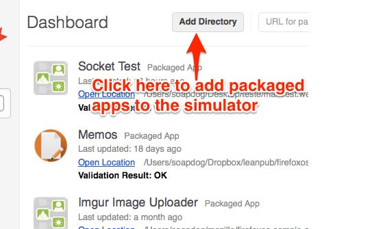
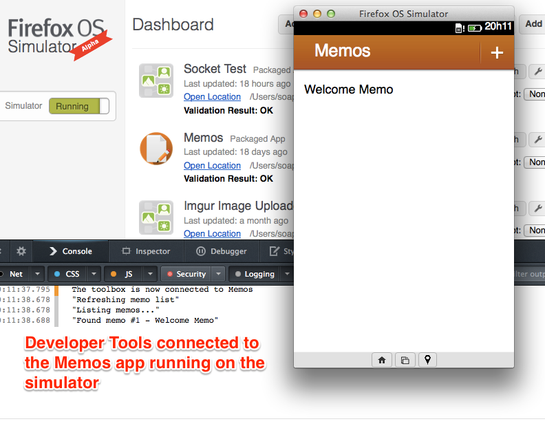
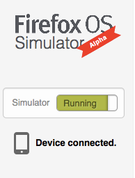
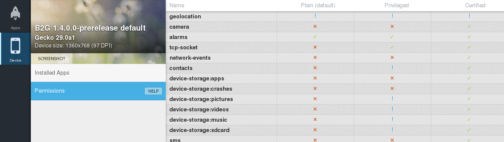

# Il Simulatore Firefox OS {#simulator}

  

W>Attenzione: Questo capitolo è presente solo per una compatibilità per i dispositivi con Firefox OS 1.1. Il metodo attuale per provare e fare il debug delle applicazioni è il'**WebIde** di cui abbiamo parlto nel capitolo precedente. Il contenuto di questo capitolo è per quelle persone che devono provare le applicazioni sulla versione 1.1 di Firefox OS.

W>Attenzione: Se stai usando **Firefox 29 o successive** e dispositivi con **Firefox OS 1.1 o precedenti** hai bisogno di un'altra versione del **Simulatore Firefox OS 1.1** che non è disponibile nell'add-ons marketplace. Questa versione è una **BETA** ma al momento non ci sono alternative. Puoi scaricarla per [Mac OS X][1], [Linux][2] o [Windows][3]. Scarica il file xpi e caricalo in Firefox e segui le istruzioni. Se vuoi seguire la questione del supporto per il **simulatore Firefox OS 1.1** su **Firefox 29** dai un'occhiata alla [bug request #1001590 it][4].  

Abbiamo installato il Simulatore Firefox OS nel capitolo [*Ambiente di sviluppo per Firefox OS*](#setup) e lo abbiamo utilizzato nel capitolo [*La prima app*](#firstapp). È giunta l'ora di approfondire la conoscenza del simulatore e imparare come effettuare le operazioni più comuni.

Per ulteriori informazioni fare riferimento alla [documentazione di Firefox OS Simulator][5] su MDN.

## Aggiungere Applicazioni

È possibile aggiungere sia applicazioni *hosted* che *packaged* al simulatore. Vediamo come fare.

### Aggiungere applicazioni packaged

È già stata trattata l'aggiunta di un'*app packaged* nel capitolo [*La prima app*](#firstapp), ma vediamo di richiamare i concetti in modo da mostrare tutte le opzioni possibili.

Per aggiungere una nuova applicazione *packaged* fare clic sul pulsante **+** nel **Gestore App**, come è mostrato nella schermata sottostante. 

Dopo aver fatto clic sul pulsante evidenziato nell'immagine,si aprirà una finestra di dialogo di selezione file. Per aggiungere l'app prescelta al simulatore, sarà sufficiente trovare la cartella dell'applicazione. Se non ci sono errori nel file manifesto e nel file che avvia l'app, essa verrà avviata nel simulatore. Se il file manifesto contiene degli errori verranno riportati nel Gestore App. 

Ogni volta che l'app verrà aggiornata sarà necessario fare clic sul pulsante **Aggiorna** per aggiornare l'applicazione nel simulatore in esecuzione (in alternativa è possibile utilizzare la scorciatoia da tastiera CMD/CTRL+R dalla finestra del simulatore).

### Aggiungere applicazioni hosted

Se si sta sviluppando un'applicazione hosted è necessario provarla utilizzando un server web. Non utilizzare il metodo descritto in precedenza con le *app hosted* in quanto alcuni errori potrebbero non essere rilevati, ad esempio un MIME Type non valido del file manifesto. Si noti che il simulatore non segnala errori, anche di una certa rilevanza come, appunto, un MIME Type non valido, ma è importante verificare che tutto funzioni se si vuole pubblicare l'app su Firefox Marketplace.

La maggior parte delle applicazioni *hosted* non sono realizzate specificatamente per Firefox OS, si tratta piuttosto di veri e propri siti web che sfruttano il design responsive per adattarsi a più dispositivi e risoluzioni. Solitamente queste app web funzionano grazie a un complesso back end che deve essere in esecuzione per consentire un loro corretto funzionamento ed è proprio per questo motivo che si rende necessario verificarne il funzionamento con un vero server web per assicurarsi che tutto funzioni correttamente.

Per caricare un'*app hosted* nel simulatore, inserire nella casella di testo, nel box in basso a sinistra, l'URL completa del manifesto dell'app e fare clic sul pulsante **+**.

Dopo aver fatto clic sul pulsante, il simulatore verificherà il file manifesto e, se non verranno rilevati errori, l'app verrà eseguita all'interno del simulatore. Eventuali errori, analogamente a quanto avviene per le *app packaged*, verranno riportati nel Gestore (ad esempio, "app submission to the Marketplace needs at least an 128 icon").

Come per le *app packaged*, ogni volta che l'app verrà aggiornata sarà necessario fare clic sul pulsante **Aggiorna** per aggiornare la versione in esecuzione nel simulatore (è anche possibile utilizzare la scorciatoia da tastiera CMD/CTRL+R dalla finestra del simulatore).

## Debug

Una volta che l'app è stata aggiunta al simulatore, accedendo al Gestore sarà possibile effettuarne il debug facendo clic sul pulsante **Avvia Simulatore** che si trova in basso nel gestore applicazione, al clic apparirà la schermata che permette di eseguire una versione specifica del simulatore (se presente) e di installarne altri. Facendo clic su **Debug** accanto al pulsante **Aggiorna** verrà lanciata l'applicazione sul simulatore. A questo punto, si aprirà un'istanza della **Console JavaScript** connessa all'app in esecuzione nel simulatore. In basso sarà possibile vedere il contenuto nel file manifest tramite visualizzazione ad albero.

Alla pressione del pulsante scelto verrà mostrata una schermata simile a quella di questa immagine:

Con gli strumenti di sviluppo connessi all'applicazione sarà possibile verificarne il funzionamento Javascript, effettuare il debug del DOM, modificare lo stile ecc. Come amano dire i ragazzi delle startup *Provare finché non è pronta*.

Quando l'app risulterà funzionante nel simulatore, sarà tempo di provarla su un vero dispositivo.

## Provare l'applicazione su un dispositivo reale

Niente può sostituire il testing su un dispositivo reale. Nel simulatore i test vengono effettuati facendo clic con un mouse su uno schermo di computer, mentre con un dispositivo reale i test si effettuano toccando uno touchscreen e premendo con le dita dei pulsanti reali. Un'esperienza utente e sviluppatore completamente diversa.

Per sottolineare l'importanza di effettuare dei test su un dispositivo reale, racconterò un fatto personale. Alcuni anni fa Raphael Eckhardt  (il designer della copertina di questo testo) e io stavamo realizzando un puzzle game simile a  Bejeweled. Il nostro gioco consisteva nel trascinare e posizionare dei pezzi su una tavola e funzionava abbastanza bene sul simulatore. 

Quando abbiamo provato il gioco su un telefono reale ci siamo resi conto che i componenti del gioco non erano ottimizzati per la piattaforma *mobile*: quando posizionavamo la mano sullo schermo tutto scompariva dietro la mano. Inoltre i componenti di gioco erano troppo piccoli per le dita, quindi gli utenti non potevano rendersi conto di quello che stavano facendo, in poche parole l'interfaccia non era un granché. Il problema era che noi avevamo effettuato i nostri test utilizzando il mouse e il puntatore del mouse è molto piccolo. Quando abbiamo provato con le nostre dita "cicciotelle" ci siamo resi conto che dovevamo rielaborare l'interfaccia.  

Per evitare di avere un'esperienza così frustrante è indispensabile verificare sempre l'app su un dispositivo reale… O ancora meglio su qualunque dispositivo si abbia a disposizione. Effettuare dei buoni test su dei semplici prototipi è molto importante per non dover perdere tempo e denaro a rimodificare tutto ogni volta.

Inoltre, nel caso si risiedesse in un paese in cui i dispositivi Firefox OS sono già in commercio, è possibile acquistare direttamente un dispositivo per l'utente finale. Un'altra soluzione è sostituire Android con Firefox OS su alcuni dispositivi (alcuni dispositivi lo supportano!) ma, a meno di non essere esperti e disposti a perdere del tempo con l'hacking, non è una cosa che mi sento di consigliare.

## Connessione con un dispositivo Firefox OS

Avendo a disposizione un dispositivo Firefox OS (con i driver installati) connesso al computer, è possibile fare un push delle applicazioni direttamente dal simulatore al dispositivo. Facendo clic nella barra laterale dove è scritto **Dispositivo** si passa al gestore del dispositivo (che può essere anche il simulatore stesso). Quando il simulatore riconosce che un dispositivo con Firefox OS phone è collegato, verrà mostrato un messaggio **Dispositivo Connesso**.

Se lo smartphone è connesso e riconosciuto, il simulatore mostrerà un nuovo pulsante chiamato **Push** accanto ai pulsanti **Aggiorna** e **Connetti**. Premendo questo pulsante, una **finestra di richiesta per i permessi** apparirà sul dispositivo chiedendo la conferma per poter procedere con l'installazione dell'applicazione.

Nell'immagine sottostante è possibile vedere la finestra di richiesta permessi:

Con l'applicazione in esecuzione nel dispositivo è possibile usare il *remote debugging* per aprire un'istanza della **Console JavaScript** collegata con l'app in modo da effettuare il debug.  

Nel Gestore App, facendo clic su **Dispositivo** si apre una schermata con le informazioni del dispositivo collegato o del simulatore.  

  

Da questo dispositivo si possono debuggare le applicazioni installate tra cui anche quelle di sistema.  

 

In questa tabella c'è un riassunto dei permessi utilizzabili nel manifest a seconda del tipo di applicazione che abbiamo visto qualche pagina fa.

## Riassunto

Riassumendo, il simulatore Firefox OS è spettacolare per creare applicazioni specifiche per Firefox OS - ma ha alcuni limiti se si vuole sviluppare un'app che funzioni su una maggior gamma di dispositivi (ad esempio al momento non è possibile emulare il comportamento di Firefox OS su un tablet). 

A questo punto del testo, oltre a una sensazione di incredibile forza, si dovrebbe, o così mi auguro, riuscire a comprendere il workflow necessario per sviluppare un'app Firefox OS. Nel prossimo capitolo vedremo come distribuire un'applicazione agli utenti.

[1]: http://ftp.mozilla.org/pub/mozilla.org/labs/r2d2b2g/r2d2b2g-5.0pre7-mac.xpi
[2]: http://ftp.mozilla.org/pub/mozilla.org/labs/r2d2b2g/r2d2b2g-5.0pre7-linux.xpi
[3]: http://ftp.mozilla.org/pub/mozilla.org/labs/r2d2b2g/r2d2b2g-5.0pre7-windows.xpi
[4]: https://bugzilla.mozilla.org/show_bug.cgi?id=1001590 "Bug simulatore"
[5]: https://developer.mozilla.org/en-US/docs/Tools/Firefox_OS_Simulator