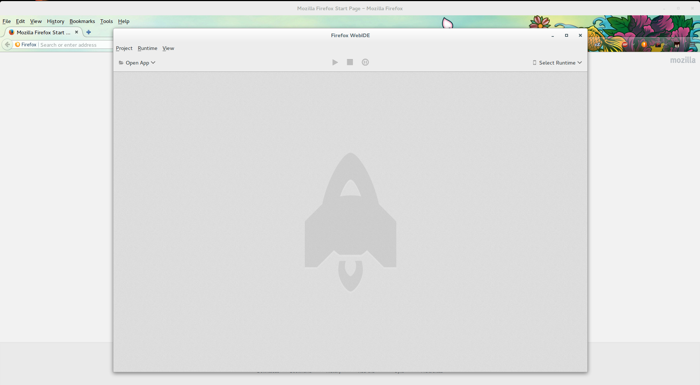
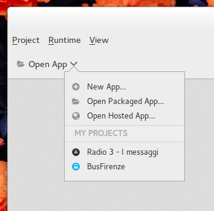
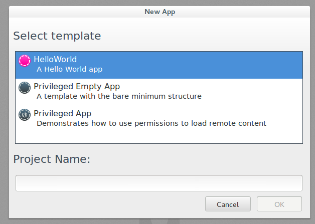
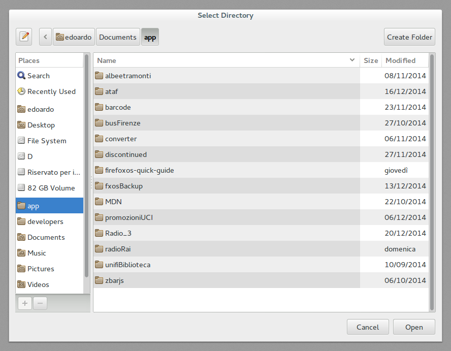
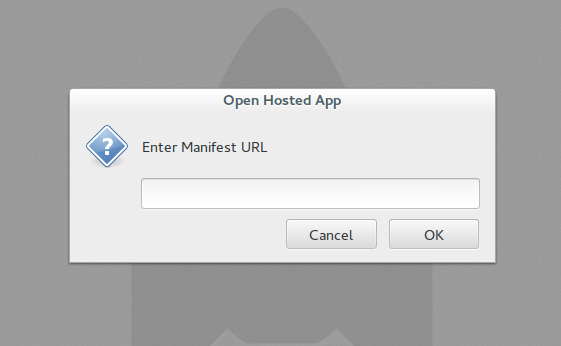
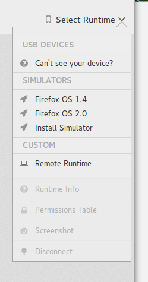
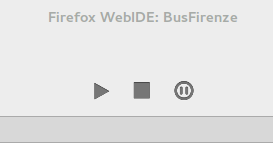
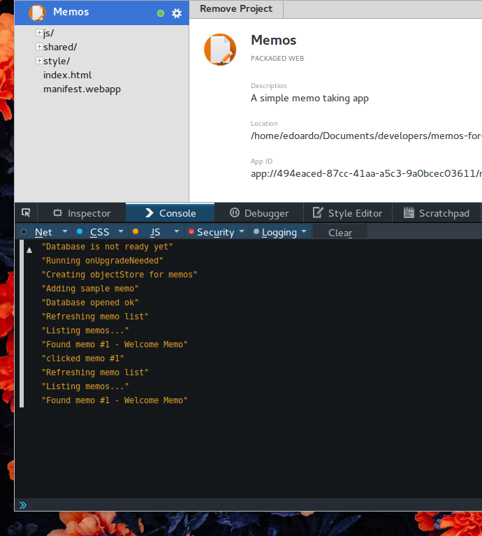
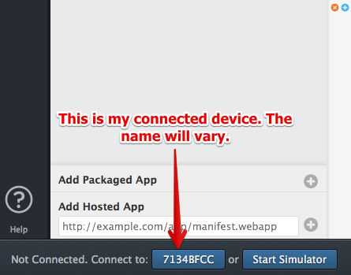

# WebIde {#webide}

Abbiamo scaricato il simulatore [nel capitolo precedente riguardo l'ambiente di lavoro](#setup) e l'abbiamo usato nel [capitolo riguardo la prima applicazione](#firstapp). Ora è tempo di dare un'occhiata più approfondita al WebIde e le sue funzionalità base.

// c'è un link simile ma dedicato al WebIde?
Per saperne di più, date un'occhiata [alla pagina Firefox OS: Usare l'App Manager][1] su MDN.

W> Ricordati: se stai usando un dispositivo Firefox OS 1.1 o ancora più vecchio devi usare il Simulatore 1.1 e non l'App Manager. Questo simulatore è spiegato nel prossimo capitolo.

## Aggiungere Applicazioni

Dal WebIde puoi accedere sia alle applicazioni remote (hosted) che locali (packaged). Vediamo come fare.

Da il menù **Progetti** puoi scegliere tra queste opzioni:

* aprire un nuovo progetto
* aprire un progetto **packaged** esistente ma non ancora aggiunto al WebIde
* aprire un progetto **hosted** esistente ma non ancora aggiunto al WebIde

Queste azioni sono replicabili anche cliccando sul bottone **Apri applicazione**

I progetti che hai già aperto vengono elencati sotto l'etichetta **I miei progetti**

### Creare un nuovo progetto

Cliccando sull'opzione **Nuova Applicazione** verrà aperta una finestra che ci propone i modelli disponibili.

Il primo è il modello base, valido sia per **packaged** che **hosted** e genera un file sul vostro computer che potete poi usare come pensate meglio.

Il secondo è un modello per un'app di tipo **privileged**, quindi per forza una app **packaged**, con una struttura minima da cui partire.

Il secondo è un modello per un'app di tipo **privileged**, quindi per forza una app **packaged**, già funzionante e finita.

### Aggiungere Applicazioni packaged 

Abbiamo già parlato di applicazioni packaged durante [la creazione della nostra prima applicazione](#firstapp), adesso è ora di provarla.

Una volta premuto **Apri App Packaged** viene apera una finestra da cui poter scegliere la cartella che contiene i file che ci interessano.

Per poter essere considerata come una app packaged una cartella ha bisogno di contenere un file **manifest.webapp** valido.

Se tutto va a buon fine la tua app verrà caricata nel WebIde e vedrai una schermata come la seguente.

// TODO: aggiungere schermata della app Memos nel WebIde

### Aggiungere Applicazioni hosted

Una volta premuto **Apri App Hosted** viene apera una finestra in cui puoi inserire l'indirizzo web a cui troviamo la tua applicazione, ovvero anche in questo caso l'indirizzo web in cui è disponibile il file **manifest.webapp**.

Per poter essere considerata come una app hoste un sito ha bisogno di un file **manifest.webapp** valido.

Se tutto va a buon fine la tua app verrà caricata nel WebIde e vedrai una schermata come la seguente.

#### Problemi con le applicazioni hosted

Se stai realizzando un'applicazione hosted dovrai provarla con un server web. Ci sono degli errori che sono caratteristici quando usiamo un server web, come servire il manifest con il *MIME type* sbagliato, problema che si conclude con l'impossibilità di installare l'app.

Nota che il simulatore non segnala errori riguardo il MIME type sbagliato, è importante controllare queste cose prima di caricare l'applicazione nel Mozilla Marketplace.

Molte delle applicazioni hosted non sono applicazioni realizzate specificatamente per Firefox OS ma si tratta di siti realizzati in modo responsive che adattano il layout della pagina allo spazio disponibile sullo schermo del dispositivo. Queste applicazioni web hanno di solito un backend complesso che serve all'applicazione per funzionare e per questo è necessario provarla in un vero web server.

Per testare *sul campo* che tutto sia a posto avvia il simulatore, naviga fino al tuo sito tramite il browser del simulatore e controlla che il simulatore ti segnali che la pagina è una Open Web App installabile.

## Avviare il simulatore

Per avviare il simulatore dopo averlo installato basta sceglierlo dal menù che appare quando premi il pulsante **Scegli **, le versioni installate vengono elencate sotto l'etichetta **Simulatori** 

## Avviare l'applicazione

Una volta che il WebIde mostra l'applicazione avvia il simulatore e premi il pulsante triangolare per installare l'applicazione ed avviarla sul simulatore.

L'icona dell'applicazione apparirà nella schermata principale del Simulatore dopo la fine dell'installazione. Fai clic sull'icona per lanciarla.

## Aggiornare l'applicazione

Ogni volta che si cambiano i file e si vuole provare nel simulatore le modifiche sarà necessario premere il pulsante triangolare che reinstallerà l'applicazione nel simulatore.[^reinstalla]

[^reinstalla]: puoi anche usare la scorciatoia da tastiera **Ctrl + r**

## Debug

Dopo che l'applicazione sarà installata nel simulatore potremo fare il debug it facendo clic sul pulsante **Debug** del WebIde, il pulsante è il cerchio con due righe verticali all'interno. Verrà aperta la **Console JavaScript** relativa all'applicazione.

Il terzo è il pulsante che avvia la Console per il Debug[^scorciatoia]

[^scorciatoia]: Alternativamente puoi premere il pulsante **F12** della tua tastiera per aprire e chiudere la console del WebIde

Dopo il clic su questo pulsante verrà aperta una schermata come questa:

COn gli strumenti connessi all'applicazione puoi provare il tuo codice JavaScript, fare il debug del DOM, modificare lo stile, ecc... esattamente come se usassi gli strumenti per sviluppatori di Firefox.

Una volta che l'applicazione è avviata sul simulatore è tempo di provarla su di un dispositivo reale.

## Provare le applicazioni su un dispositivo reale

Niente può sostituire il testing su un dispositivo reale. Nel simulatore i test vengono effettuati facendo clic con un mouse su uno schermo di computer, mentre con un dispositivo reale i test si effettuano toccando uno touchscreen e premendo con le dita dei pulsanti reali. Un'esperienza utente e sviluppatore completamente diversa.

Per sottolineare l'importanza di effettuare dei test su un dispositivo reale, racconterò un fatto personale. Alcuni anni fa Raphael Eckhardt  (il designer della copertina di questo testo) e io stavamo realizzando un puzzle game simile a  Bejeweled. Il nostro gioco consisteva nel trascinare e posizionare dei pezzi su una tavola e funzionava abbastanza bene sul simulatore. 

Quando abbiamo provato il gioco su un telefono reale ci siamo resi conto che i componenti del gioco non erano ottimizzati per la piattaforma *mobile*: quando posizionavamo la mano sullo schermo tutto scompariva dietro la mano. Inoltre i componenti di gioco erano troppo piccoli per le dita, quindi gli utenti non potevano rendersi conto di quello che stavano facendo, in poche parole l'interfaccia non era un granché. Il problema era che noi avevamo effettuato i nostri test utilizzando il mouse e il puntatore del mouse è molto piccolo. Quando abbiamo provato con le nostre dita "cicciotelle" ci siamo resi conto che dovevamo rielaborare l'interfaccia.  

Per evitare di avere un'esperienza così frustrante è indispensabile verificare sempre l'app su un dispositivo reale… O ancora meglio su qualunque dispositivo si abbia a disposizione. Effettuare dei buoni test su dei semplici prototipi è molto importante per non dover perdere tempo e denaro a rimodificare tutto ogni volta.

## Connettere un dispostivo Firefox OS

Adesso che sappiamo quanto sia importante testare il proprio lavoro prima di consegnarlo al mondo vediamo come possiamo usare il WebIde in simbiosi con un dispositivo reale per provare il nostro lavoro.

* Installa i driver del tuo dispositivo[^driver]
* Installa **adb**
* Installa **ADB Helper**
* collega il dispositivo al computer tramite il cavo USB

[^driver]: se lavori in ambiente Windows, altrimenti non ne hai bisogno

Da adesso se hai installato l'addon per Firefox **ADB Helper** verrà segnalato al WebIde che esiste il tuo dispositivo e questo verrà aggoiunto sotto l'etichetta **Dispositivi USB**.

Puoi decidere di usare il tuo dispositivo al posto del simulatore, andando quindi ad installare la tua app su quello.

Al primo collegamento tra dispositivo e WebIde apparirà un messaggio di avviso sul telefono;  dobbiamo dare il permesso al WebIde di agire sul telefono quindi scegliamo di *confermare il collegamento*.

Una volta che la connessione è effettuata sarà possibile usare i pulsanti **Aggiorna** e **Debug** nel WebIde per aggiornare e fare il debug dell'applicazione sul dispositivo connesso come con il simulatore.

## Riassunto

Per riassumere, il WebIde è fantastico. Molto meglio rispetto alla vecchia estensione del Firefox OS 1.1 Simulator e anche meglio dell'App Manager.

Adesso abbiamo a disposisizione un ambiente di sviluppo completo con cui possiamo gestire tutto il ciclo del nostro lavoro.

Arrivati a questo punto avrai la sensazione di aver capito come stanno andando le cose, quali sono gli strumenti che ti servono e come dovrebbe procedere il tuo lavoro quando vuoi realizzare una app per Firefox OS.

Nel prossimo capitolo parleremo della vecchia versione del Simulatore di Firefox OS 1.1. Questo studio è necessario se si devono connettere dispositivi con Firefox OS 1.1. Il capitolo è molto simile a a questo infatti i contenuti sono gli stessi ma cambiano le interfacce degli strumenti.

Dopo il capitolo sul simulatore parleremo della distribuzione della tua applicazione.

[1]: https://developer.mozilla.org/it/Firefox_OS/usare_l_app_Manager