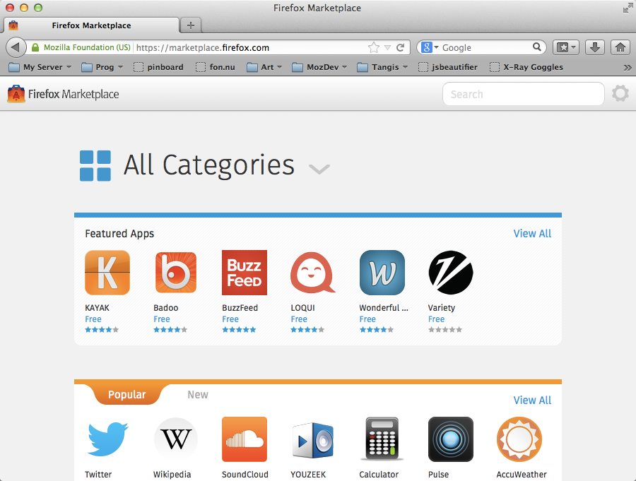
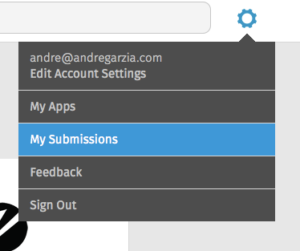
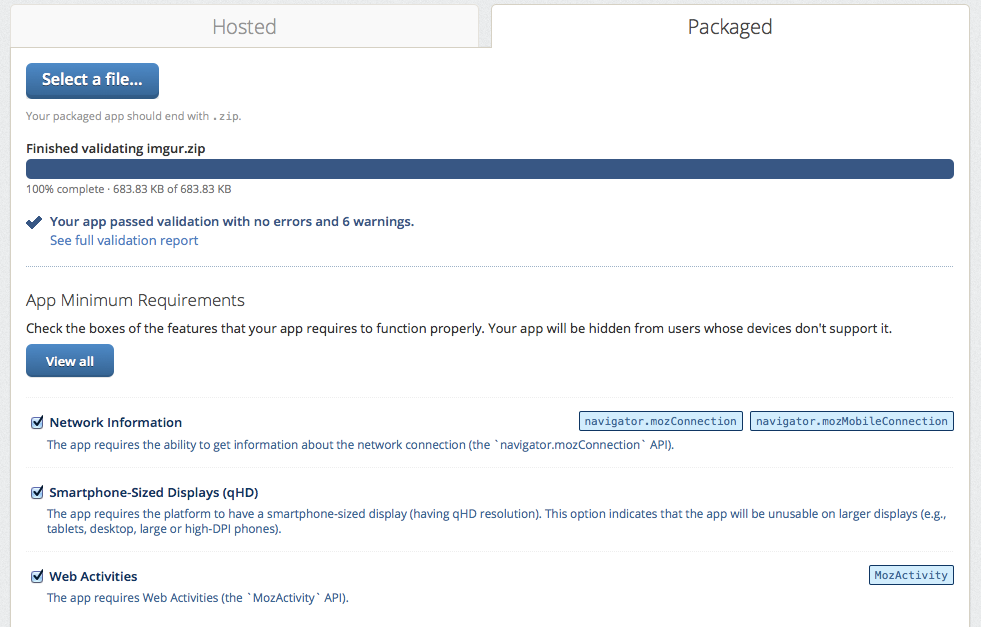

# Firefox Marketplace

[Firefox Marketplace](http://marketplace.firefox.com) è il negozio online dal quale è possibile scaricare o acquistare applicazioni per Firefox OS, Firefox, e Firefox per Android. Questo è il principale canale di distribuzione per le app Firefox OS, tuttavia non è l'unica alternativa possibile. Se sei interessato a distribuire app esternamente al Marketplace leggi il [capitolo precedente](#distribution).

Per pubblicare un'app sul Marketplace è necessario effettuare l'identificazione tramite [Mozilla Persona](https://login.persona.org/about). Sarà sufficiente fare clic sul pulsante **Registrati** e seguire le istruzioni. Una volta effettuato l'accesso al Marketplace sarà possibile pubblicare l'app.

## Operazioni che precedono l'ideazione di un'app

Tutte le applicazioni pubblicate sul Marketplace sono sottoposte a un processo di verifica e devono essere approvate dai revisori del sito (non ci si preoccupi troppo, è meno pauroso di quanto sembri). Il processo di controllo delle app ospitate e delle app pacchettizzate semplici è più snello rispetto a quello delle app con privilegi, in quanto le prime utilizzano API meno sensibili. Prima di inviare un'app su Firefox Marketplace leggere attentamente [le linee guida per la revisione](https://developer.mozilla.org/en-US/docs/Web/Apps/Publishing/Marketplace_review_criteria). A mio avviso le parti più importanti sono:  

* I dispositivi Firefox OS, contrariamente ai dispositivi Android e ai browser desktop, non hanno un pulsante **Indietro**. Nel caso in cui l'app rimandi a una pagina dalla quale non è possibile ritornare più indietro (in altre parole se l'utente nell'utilizzo dell'app arriva a un punto morto) l'app verrà rifiutata.
* L'app deve avere un'icona di 60x60 pixel e una descrizione chiara del suo funzionamento.
* L'app deve funzionare esattamente come riportato nella sua descrizione. Se nella descrizione si dichiarano delle caratteristiche e nell'utilizzo ne emergono delle altre, l'app verrà respinta.
* Se l'app richiede un'autorizzazione particolare si è obbligati a farne uso nel codice sorgente. Dichiarare che si tratta di un'app con privilegi e non fare uso di alcuna API fra quelle riservate alle app con privilegi, porterà al rifiuto dell'app da parte dei revisori che chiederanno allo sviluppatore di ripubblicarla come app semplice. 
* L'applicazione deve essere accompagnata da **un'informativa sulla privacy**.
* I file manifesto dovrebbero essere distribuiti con il corretto *MIME type* e utilizzare lo stesso dominio di origine in caso di app ospitate.

Alla pagina sopraindicata vengono discussi altri criteri di validità e altri potrebbero essere aggiunti in futuro senza un'esplicita comunicazione. Sarà utile impiegare bene il proprio tempo e leggere con attenzione quella pagina. Vedere la propria applicazione rifiutata per delle sciocchezze che richiedono poco sforzo per essere risolte è una gran perdita di tempo. È sempre meglio iniziare a fare le cose per bene sin dall'inizio (i revisori sono ben lieti di approvare delle buone app).

## Operazioni preliminari prima della pubblicazione

I passaggi richiesti per la pubblicazione di un'app sul Marketplace variano a seconda che si tratti di un'*app hosted* o di un'app pacchettizzata. Nel caso di *app hosted*, è sufficiente che sia raggiungibile online e che il manifesto sia distribuito con il corretto *MIME type*. I file delle *app packaged* devono essere raccolti in un archivio compresso utilizzando il formato *zip* e richiedono qualche maggiore attenzione.  

Un errore comune a molti sviluppatori è quello di selezionare la cartella che contiene i file dell'app e di comprimerla. Come risultato il file *zip* contiene una cartella che a sua volta contiene l'app vera e propria. Questo non è il modo corretto per creare l'archivio *zip* di un'applicazione Firefox OS. Il modo corretto di creare l'archivio *zip* consiste nel selezionare tutti i file e le cartelle dell'app in modo che il file manifesto sia nel *primo livello* dell'archivio. Su sistemi operativi Mac e Linux è possibile aprire il Terminale, navigare fino alla directory dell'app e eseguire il comando `zip -r myapp.zip *` per ottenere il risultato desiderato, come mostrato nello screenshot sottostante.

Questo file *zip* è quello che dovremo pubblicare sul Marketplace.

## Pubblicazione dell'app sul Marketplace

Ora che l'applicazione è pronta - e con la consapevolezza che dovrà soddisfare i criteri del Marketplace per essere approvata dai revisori - è tempo di pubblicarla sul Marketplace. Per farlo, ffare clic su **Le mie app** utilizzando il pulsante a forma di ingranaggio posizionato in alto nella pagina del Marketplace.

Arrivati nella pagina di gestione dei caricamenti, fare clic su **Invia un'app** dal menu superiore.

Come è possibile notare dallo screenshot qui sotto, questo link aprirà il modulo per l'invio di nuove app.

Da questa pagina si dovranno impostare le seguenti opzioni:

* Se si tratta di un'*app hosted* o di un'*app packaged*.
* Se si tratta di un'app gratuita o di un'app a pagamento (o se utilizza i *pagamenti in-app*).
* Per quali dispositivi è disponibile (Firefox OS, Firefox Desktop, Firefox per mobile su telefonino, Firefox mobile per tablet, ecc…).

Dopo aver impostato queste preferenze si verrà rimandati a un'altra pagina. In questo testo tratteremo esplicitamente il caso di un'app pacchettizzata, ma la procedura è analoga per un'app ospitata.

Nel proseguo del capitolo faremo sempre riferimento a un'app pacchettizzata gratuita per Firefox OS.  In questo caso dobbiamo caricare il file *zip* della nostra app, di cui si è discusso nella sezione precedente.

Dopo aver effettuato l'upload del file, questo subirà un processo automatico di verifica e al termine verrà mostrato un resoconto con una serie di opzioni.

Dallo screenshot mostrato qui sopra, è possibile notare che l'app da me caricata non  presenta errori, ma riporta 6 avvisi. Ignorando la discussione degli avvisi per non complicare eccessivamente la trattazione, concentriamoci sul significato della voce **Requisiti minimi** della nostra app. In questo specifico caso, l'ultima opzione *Smartphone-Sized Displays (qHD)* dovrebbe essere deselezionata in quanto la nostra applicazione si adatta a schermi di qualunque dimensione.

Il passaggio successivo è denominato **Passaggio #3: dettagli** ed è quello in cui si dovranno inserire delle informazioni dettagliate sull'app, come categoria, testo descrittivo, qualche screenshot, ecc…

Dopo aver inserito in dettaglio le informazioni sull'app, il processo di caricamento è completo.  
Arriveremo ad un passaggio dedicato alla certificazione guidata dell'applicazione in cui ci verrà chiesto di selezionare gli argomenti trattati se sono violenti, illeciti, se è un gioco ecc. In questo modo la nostra applicazione verrà certificata per la sua comparsa sui vari paesi a seconda proprio di questo passaggio obbligatorio.  
Ora non ci resta che attendere l'approvazione da parte dei revisori del Marketplace. Complimenti, l'app ora è distribuita su Firefox Marketplace.

Dalla [pagina di gestione delle app](https://marketplace.firefox.com/developers/submissions) sarà possibile verificare lo stato delle app caricate e, se lo si desidera, modificare le informazioni dell'app.  
Dalla pagina di gestione dell'app potremo anche vedere le statistiche di installazione, visita, supporto ecc.  

Per ulteriori informazioni riguardo al caricamento delle app consultare [questo articolo del Centro di sviluppo di Firefox OS](https://marketplace.firefox.com/developers/docs/submission).  

## Guide linea per il marketplace

Le applicazioni quando sono inviate nel marketplace vengono controllate da tool automatici e testate da volontari di Mozilla. Questi volontari a loro volta sono sottoposti a dei test per verificare le loro conoscenze.  

I criteri di accettazione dell'applicazione sono molteplici e passano dalla sicurezza, privacy, contenuto, funzionalità ed usabilità.  

Durante il processo di recensione verrà controllato il file manifest per la completezza delle informazioni quindi è molto importante che sia completo e preciso perché è uno dei primi motivi per cui può essere bocciata. Per esempio specificando lingue disponibili che non lo sono, permessi documentati male, screenshot mancante o descrizione incompleta.  

Un dettaglio da non dimenticare è che i recensori non sono un team di QA, fanno dei test d'uso come un'utente normale e provano l'applicazione sui sistemi specificati nel marketplace.  

Il recensore in caso di rifiuto dell'applicazione fornisce una spiegazione dei problemi riscontrati spiegando i passaggi per riprodurre i problemi dando riferimenti alla documentazione per correggere le carenze. Non commenta la grafica dell'applicazione ma solo come l'applicazione funziona. Lo sviluppatore avrà sempre il beneficio del dubbio e potrà rinviare l'applicazione e chiedere maggiori dettagli sulle motivazioni del rifiuto. 

### Sicurezza

Per maggiori informazioni fate riferimento alla pagina dedicata [su MDN](https://wiki.mozilla.org/Apps/Security).  

Il manifest deve essere fornito dallo stesso origin dell'applicazione quindi lo stesso dominio, deve essere fornito con il mime-type `application/x-web-app-manifest+json` e l'applicazione non deve contenere iframe.  
Questo impedisce ad altre persone di fare applicazioni hosted il cui sito non è di loro gestione. 

## Privacy

Per l'approvazione deve essere presentata una privacy policy ma non ci sono requisiti specifici sul formato o contenuto. Un [template di esempio](https://github.com/flamsmark/privacy-policy-template) con del [materiale di riferimento e consigli](https://developer.mozilla.org/en-US/Marketplace/Publishing/Privacy_policies).

## Contenuto

Non deve contenere materiale pornografico, codice maligno o promozione di materiale illegale/gioco d'azzardo/servizi illegali. Potremmo dire regole di buon senso!

## Funzionalità

Il revisore deve provare le funzionalità principali dell'applicazione, se ci sono piccoli problemi tecnici o problemi grafici potrà essere approvata. Inoltre come abbiamo già detto non deve compromettere il sistema o la sua stabilità.

## Usabilità

Lo sviluppatore deve cercare di ottimizzare l'applicazione sia a livello di layout che di piattaforma. Dettaglio da non trascurare che Firefox OS non ha pulsanti fisici quindi deve avere dei pulsanti di navigazione. Cosa molto importante se qualcosa deve essere cliccabili/tappabile deve avere delle dimensioni usabili.

## Alcuni consigli

Se stai realizzando un gioco consiglio di presentare le istruzioni subito invece della partita già avviata e specificare se l'applicazione è per Firefox Desktop/Firefox for Android/Firefox OS mobile o Firefox OS per tablet.  

Inserisci dei bei screenshot dell'applicazione che sono una vetrina del tuo lavoro.

## Riassunto

Complimenti. La propria nuova applicazione ora è su Firefox Marketplace e ci si sta apprestando a esplorare un nuovissimo tipo di mercato.

=======
Spero che la lettura di questa veloce guida sia stata piacevole. Ho in mente di aggiornare e ampliare spesso questa guida, quindi consiglio di tenere gli occhi aperti e iscriversi per ricevere le notizie sul suo aggiornamento. Se si è scaricato questo testo dal sito Leanpub non ci sono problemi: si riceverà automaticamente un'email che informerà di nuovi aggiornamenti. Se invece è stato scaricato da altri siti, il mio consiglio è quello di riscaricarlo da  [pagina ufficiale su Leanpub](http://leanpub.com/quickguidefirefoxosdevelopment) e registrare il proprio indirizzo email. Ovviamente è tutto gratuito e, no, non verranno  mai inviati messaggi di spam, promesso.

Invito tutti i lettori ad inviarmi le proprie opinioni su questo lavoro (in inglese). Questo testo è stato scritto nelle notti precedenti una conferenza tecnica, quindi si può intuire quanto io sia affezionato a questo progetto e quanto vorrei che avesse successo. È possibile inviare le proprie opinioni via Twitter al mio account [@soapdog](http://twitter.com/soapdog) o al mio indirizzo di posta elettronica [fxosquickguide@andregarzia.com](mailto:fxosquickguide@andregarzia.com).  Il mio sito web è [http://andregarzia.com](http://andregarzia.com).

Ora che si è entrati a far parte del gruppo di sviluppatori di app Firefox OS, il prossimo passo è quello di unirsi al gruppo più esteso della comunità Mozilla, aiutandoci a mantenere il Web libero e creato dagli utenti per gli utenti.  
È possibile unirsi a noi visitando [http://www.mozilla.org/contribute/](http://www.mozilla.org/en-US/contribute/) e aiutare la crescita di Firefox OS.

