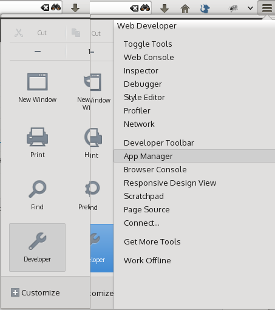
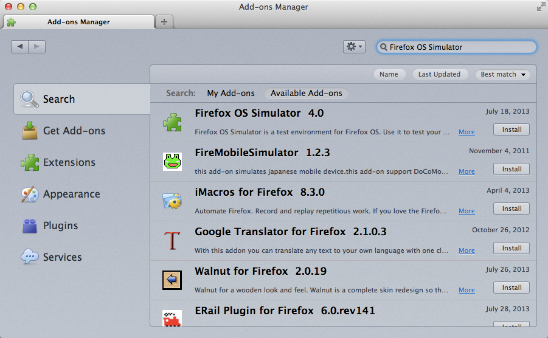

# Ambiente di sviluppo per Firefox OS {#setup}

## Il motore Gecko
I browser utilizzano diversi motori di rendering per le pagine web: Google Chrome e Opera utilizzano Blink (un fork di WebKit), Internet Explorer utilizza Trident, mentre Safari usa WebKit. Mozilla ha il suo engine, chiamato Gecko, che viene usato da Firefox desktop, Firefox per Android, e Firefox OS. Poiché questi prodotti usano lo stesso motore o engine, è possibile sviluppare per Firefox OS usando il browser Firefox desktop (con alcuni svantaggi[^engine]).

[^engine]: Nonostante i prodotti Mozilla utilizzino lo stesso motore di rendering, la versione di Gecko disponibile in Firefox OS è meno aggiornata rispetto alla quella di Firefox desktop. Questo perché il ciclo di rilascio di Firefox OS è più lento rispetto a quello della versione Desktop. In pratica, questo vuol dire che alcune funzionalità non sono disponibili (o non funzionano come immaginato) quando si trasportano su Firefox OS - quindi è sempre importante verificare che la propria applicazione funzioni su un dispositivo Firefox OS. Inoltre, bisogna ricordarsi che gli utenti possono utilizzare versioni differenti di Firefox OS, quindi alcune potrebbero non avere tutte le funzionalità richieste. È importante fornire sempre un'alternativa in caso alcune di queste funzionalità non siano disponibili.

## Di che cosa abbiamo bisogno?

Per sviluppare e testare le applicazioni realizzate per Firefox OS abbiamo bisogno di:

 * Una versione recente di [Firefox desktop](http://getfirefox.com).
 * [Firefox OS Simulator](https://addons.mozilla.org/en-US/firefox/addon/firefox-os-simulator/). 
 * Un editor testuale per programmare[^editor].
 
[^editor]: esistono molti buoni editor con diversi livelli di complessità e caratteristiche. Un editor molto diffuso, che mi sento di consigliare a chi non ha ancora trovato il suo preferito, è [SublimeText](http://sublimetext.com/). Personalmente, io uso [WebStorm](http://www.jetbrains.com/webstorm/) che è un IDE completo per la realizzazione di web app.
  
## Installare il Simulatore di Firefox OS

Dopo aver installato Firefox,  il passaggio successivo è l'installazione del simulatore di Firefox OS che può essere usato per testare le proprie applicazioni. Con Firefox installato e funzionante, andare nel menu **Strumenti** e selezionare **Componenti aggiuntivi**.

Utilizzando il campo di ricerca posto in alto a destra, cercare **Firefox OS Simulator** e installare l'estensione facendo clic sul pulsante di installazione.

Dopo l'installazione dell'estensione, potrai accedere al simulatore andando al menu **Strumenti -> Sviluppo web -> Firefox OS Simulator**. 

Altrimenti, è possibile visitare direttamente la pagina di [Firefox OS Simulator](https://addons.mozilla.org/en-US/firefox/addon/firefox-os-simulator/) e scaricare il simulatore da qui.

## Riassunto

In questo capitolo abbiamo imparato che tutto ciò di cui abbiamo bisogno per sviluppare *app Firefox OS* è il browser Firefox desktop con installata l'estensione *Firefox OS Simulator* (e un buon editor di testo).

Ora che abbiamo configurato l'ambiente di sviluppo, siamo pronti per soffermarci su qualche concetto base prima di creare la nostra prima app.
